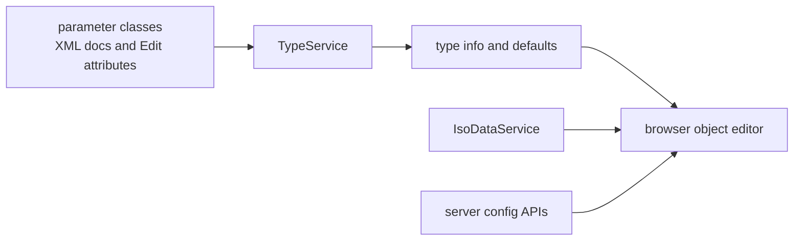

# SysWeaver.MicroService.Edit

[⬆ SysWeaver overview](../README.md)

> The generic object editor: type metadata and default instances for a browser-based editor that can edit any serializable object — used, for example, to edit the server's own service manifest.

| | |
|---|---|
| **Layer** | Administration |
| **Kind** | Micro services with a large web front-end |

## Purpose

Configuration objects in SysWeaver are plain classes documented with XML comments and `Edit*` hints. This service describes those types to the browser, which renders appropriate editors (numbers with ranges, sliders, passwords, countries, conditional visibility, …).

## How it fits into SysWeaver

## Limitations and considerations

- Editing quality depends on XML documentation and edit attributes on the types.

## Relationships

- **Project:** [`SysWeaver.MicroService.Edit.csproj`](SysWeaver.MicroService.Edit.csproj)
- **Builds on:** [SysWeaver.Docs](../SysWeaver.Docs/README.md), [SysWeaver.HttpServer.IsoDataModule](../SysWeaver.HttpServer.IsoDataModule/README.md), [SysWeaver.HttpServer](../SysWeaver.HttpServer/README.md), [SysWeaver.MicroServices.ServiceManager](../SysWeaver.MicroServices.ServiceManager/README.md), [SysWeaver.MicroServices](../SysWeaver.MicroServices/README.md)
