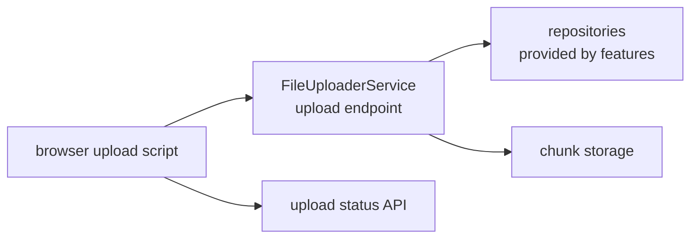

# SysWeaver.MicroService.FileUploader

[⬆ SysWeaver overview](../README.md)

> Browser file uploads into named repositories, with status tracking and chunk-based storage.

| | |
|---|---|
| **Layer** | Files |
| **Kind** | Micro service |

## Purpose

A single, reusable upload mechanism for all features that accept files (user images, user storage, thumbnails, server management).

## How it fits into SysWeaver

## Limitations and considerations

- Repositories define what is accepted; the uploader itself is generic.

## Relationships

- **Project:** [`SysWeaver.MicroService.FileUploader.csproj`](SysWeaver.MicroService.FileUploader.csproj)
- **Builds on:** [SysWeaver.Common](../SysWeaver.Common/README.md), [SysWeaver.HttpServer](../SysWeaver.HttpServer/README.md), [SysWeaver.MicroServices.ServiceManager](../SysWeaver.MicroServices.ServiceManager/README.md), [SysWeaver.MicroServices](../SysWeaver.MicroServices/README.md), [SysWeaver.Storage.Cdc](../SysWeaver.Storage.Cdc/README.md)
- **Used by:** [SysWeaver.MicroService.CustomUserImage](../SysWeaver.MicroService.CustomUserImage/README.md), [SysWeaver.MicroService.ServerManager](../SysWeaver.MicroService.ServerManager/README.md), [SysWeaver.MicroService.Thumbnail.Web](../SysWeaver.MicroService.Thumbnail.Web/README.md), [SysWeaver.MicroService.UserStorage](../SysWeaver.MicroService.UserStorage/README.md)
