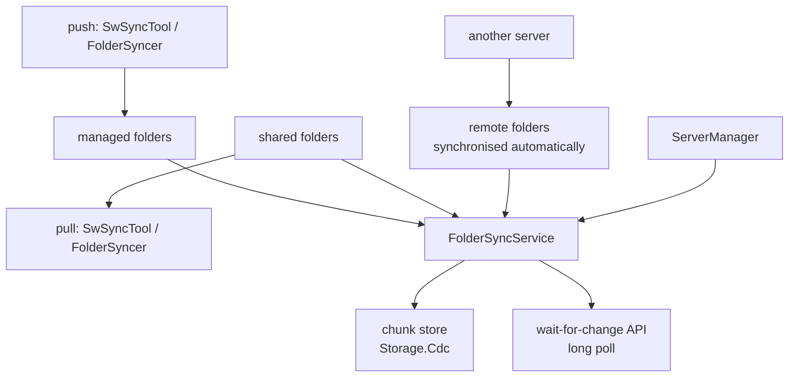

# SysWeaver.MicroService.FolderSync

[⬆ SysWeaver overview](../README.md)

> Server side of folder synchronisation: managed folders that can be updated remotely, shared folders that clients pull, and remote folders the server keeps in sync from elsewhere — all with chunk-level transfer and change notification.

| | |
|---|---|
| **Layer** | Files |
| **Kind** | Micro service |

## Purpose

A deployment and distribution hub: build servers push new versions, target machines pull shared folders or are updated automatically.

## How it fits into SysWeaver

## Key features

- Three folder roles (managed, shared, remote) configured independently.
- Binary upload handler for efficient chunk transfer.
- Versioning with manifests; long-poll notification when a shared folder changes.
- Operator tables for all folder types.

## Limitations and considerations

- Storage grows with versions until chunks are pruned.
- Folder-level auth must be configured carefully — managed folders can overwrite deployed content.

## Relationships

- **Project:** [`SysWeaver.MicroService.FolderSync.csproj`](SysWeaver.MicroService.FolderSync.csproj)
- **Builds on:** [SysWeaver.FolderSync](../SysWeaver.FolderSync/README.md), [SysWeaver.MicroServices.ServiceManager](../SysWeaver.MicroServices.ServiceManager/README.md), [SysWeaver.Storage.Cdc](../SysWeaver.Storage.Cdc/README.md)
- **Used by:** [SysWeaver.MicroService.ServerManager](../SysWeaver.MicroService.ServerManager/README.md)
