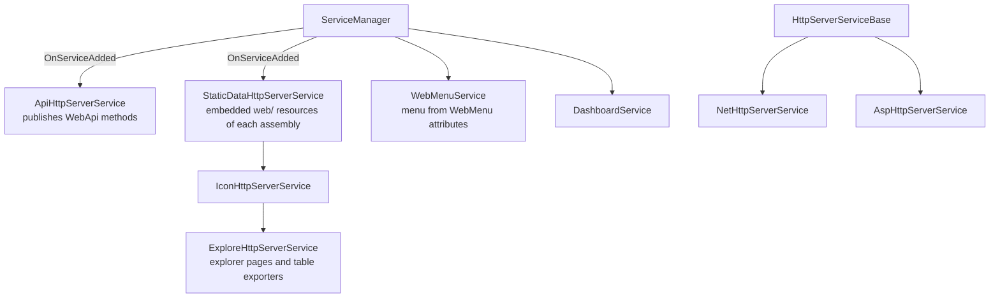

# SysWeaver.MicroService.HttpServer

[⬆ SysWeaver overview](../README.md)

> The micro services that assemble a complete web front-end from the manifest: API publishing, embedded web assets, icons, the developer explorer, the navigation menu and dashboards — plus the common base class of the HTTP server services.

| | |
|---|---|
| **Layer** | HTTP (service integration) |
| **Kind** | Micro services |

## Purpose

Bridge the [SysWeaver.HttpServer](../SysWeaver.HttpServer/README.md) library and the [SysWeaver.MicroServices.ServiceManager](../SysWeaver.MicroServices.ServiceManager/README.md). Each service here is a small adapter that creates a module, registers it, and keeps it in sync as other services come and go.

## How it fits into SysWeaver



## Key concepts

| Service | Role |
|---|---|
| **API service** | Publishes the `[WebApi]` methods of the service manager and of every local service, including services registered later, and connects audit services. |
| **Static data service** | Serves embedded resources placed in a project's `web/` folder, for the assembly of every registered service — adding a service automatically adds its web pages. |
| **Icon service** | Serves the shared icon set. |
| **Explore service** | Developer/diagnostic pages and the table export formats offered in the UI. |
| **Menu service** | Collects `[WebMenu*]` declarations of all services into the UI menu. |
| **Dashboard service** | Serves dashboards composed of items. |
| **Server service base** | Creates the HTTP server, binds certificate providers, the auth manager, firewall handler, translator and audit service, attaches every module/transformer service, and provides admin APIs to view and edit the server's manifest and restart the process. |

## Key features

- A web application appears by listing services — no routing or startup code.
- Late-registered services are published automatically.
- Web-based administration of the manifest, with access to previous and last-known-good versions.

## Limitations and considerations

- Some services resolve dependencies in their constructors and must be ordered accordingly (icons after static data, explorer after both, HTTP server after auth manager and certificate providers).
- Multiple instances of these services are discouraged by their own documentation.

## Using it

```json
[
  { "Type": "SysWeaver.MicroService.NetHttpServerService, SysWeaver.MicroService.NetHttpServer",
    "Params": { "ListenOn": [ { "Prefix": "http://localhost:8080" } ] } },
  { "Type": "SysWeaver.MicroService.StaticDataHttpServerService, SysWeaver.MicroService.HttpServer" },
  { "Type": "SysWeaver.MicroService.IconHttpServerService, SysWeaver.MicroService.HttpServer" },
  { "Type": "SysWeaver.MicroService.ExploreHttpServerService, SysWeaver.MicroService.HttpServer" },
  { "Type": "SysWeaver.MicroService.WebMenuService, SysWeaver.MicroService.HttpServer" },
  { "Type": "SysWeaver.MicroService.ApiHttpServerService, SysWeaver.MicroService.HttpServer" }
]
```

## Relationships

- **Project:** [`SysWeaver.MicroService.HttpServer.csproj`](SysWeaver.MicroService.HttpServer.csproj)
- **Builds on:** [SysWeaver.Auth.Core](../SysWeaver.Auth.Core/README.md), [SysWeaver.CommandLine](../SysWeaver.CommandLine/README.md), [SysWeaver.HttpServer.ExploreModule](../SysWeaver.HttpServer.ExploreModule/README.md), [SysWeaver.HttpServer.IconModule](../SysWeaver.HttpServer.IconModule/README.md), [SysWeaver.HttpServer](../SysWeaver.HttpServer/README.md), [SysWeaver.MicroServices.ServiceManager](../SysWeaver.MicroServices.ServiceManager/README.md), [SysWeaver.Storage](../SysWeaver.Storage/README.md)
- **Used by:** [SysWeaver.MicroService.AspHttpServer](../SysWeaver.MicroService.AspHttpServer/README.md), [SysWeaver.MicroService.NetHttpServer](../SysWeaver.MicroService.NetHttpServer/README.md)
