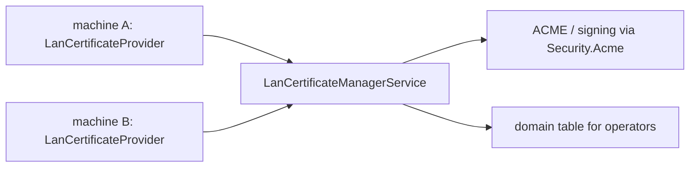

# SysWeaver.MicroService.LanCertificateManager

[⬆ SysWeaver overview](../README.md)

> Central issuer of certificates for LAN domains: other SysWeaver machines request and renew their certificates from this service.

| | |
|---|---|
| **Layer** | Security |
| **Kind** | Micro service |

## Purpose

Give internal machines valid certificates for LAN host names from one place, instead of managing certificates on each machine. Clients use the LAN certificate provider from [SysWeaver.Security](../SysWeaver.Security/README.md).

## How it fits into SysWeaver

## Limitations and considerations

- The manager is a single point of trust and availability for all LAN certificates.
- Not included in the main solution file.

## Relationships

- **Project:** [`SysWeaver.MicroService.LanCertificateManager.csproj`](SysWeaver.MicroService.LanCertificateManager.csproj)
- **Builds on:** [SysWeaver.MicroServices.ServiceManager](../SysWeaver.MicroServices.ServiceManager/README.md), [SysWeaver.Security.Acme](../SysWeaver.Security.Acme/README.md)
