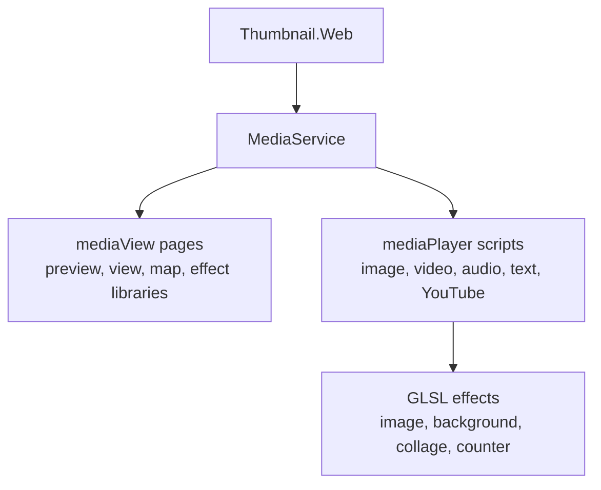

# SysWeaver.MicroService.Media

[⬆ SysWeaver overview](../README.md)

> A browser-based media player and viewer: images, video, audio, text and YouTube with WebGL shader effects, collages, animated counters and map views.

| | |
|---|---|
| **Layer** | Media |
| **Kind** | Micro service with a web application |

## Purpose

Present media attractively in the browser — previews, slideshows, signage-style displays — with effects rendered on the GPU. The service ships the viewer/player pages and shader libraries, and lists the available effects through its API.

## How it fits into SysWeaver

## Limitations and considerations

- Effects require WebGL-capable browsers and GPUs; heavy effects can be demanding on low-end devices.
- Map features need a Google Maps key, which is only exposed to developers.

## Relationships

- **Project:** [`SysWeaver.MicroService.Media.csproj`](SysWeaver.MicroService.Media.csproj)
- **Builds on:** [SysWeaver.Common](../SysWeaver.Common/README.md), [SysWeaver.Compression](../SysWeaver.Compression/README.md), [SysWeaver.MicroServices.ServiceManager](../SysWeaver.MicroServices.ServiceManager/README.md)
- **Used by:** [SysWeaver.MicroService.Thumbnail.Web](../SysWeaver.MicroService.Thumbnail.Web/README.md)
