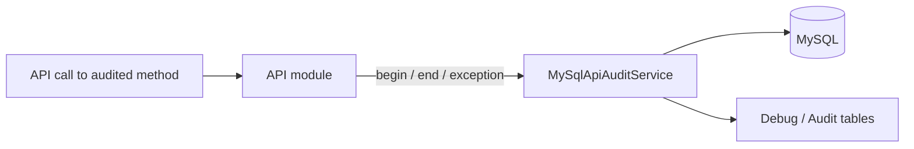

# SysWeaver.MicroService.MySqlAudit

[⬆ SysWeaver overview](../README.md)

> Audit trail for web API calls: every method marked `[WebApiAudit]` is recorded with its caller in MySQL and browsable in the web UI.

| | |
|---|---|
| **Layer** | Security |
| **Kind** | Micro service (`IApiAuditService`) |

## Purpose

Accountability for sensitive operations. Service authors only add `[WebApiAudit]`; this service captures begin/end/exception of those calls.

## How it fits into SysWeaver



## Limitations and considerations

- Only methods explicitly marked for auditing are recorded.
- Parameters and results may contain personal data; use the audit filter attributes to redact them.

## Using it

```json
{ "Type": "SysWeaver.MicroService.MySqlApiAuditService, SysWeaver.MicroService.MySqlAudit",
  "Params": { "Server": "db.local", "Schema": "audit" } }
```

## Relationships

- **Project:** [`SysWeaver.MicroService.MySqlAudit.csproj`](SysWeaver.MicroService.MySqlAudit.csproj)
- **Builds on:** [SysWeaver.DbSimpleStack.MySql](../SysWeaver.DbSimpleStack.MySql/README.md), [SysWeaver.MicroServices.ServiceManager](../SysWeaver.MicroServices.ServiceManager/README.md)
- **Used by:** [SysWeaver.WebBrowser.Cef](../SysWeaver.WebBrowser.Cef/README.md)
