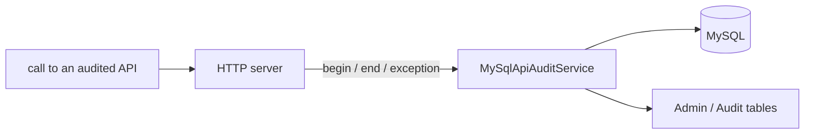

# SysWeaver.MicroService.MySqlAudit

[⬆ SysWeaver overview](../README.md)

> Audit trail for web API calls: every method marked `[WebApiAudit]` is recorded with its caller in MySQL and browsable in the web UI.

| | |
|---|---|
| **Layer** | Security |
| **Kind** | Micro service (`IApiAuditService`, `IApiAuditReportService`) |

## Purpose

Accountability for sensitive operations. Service authors only add `[WebApiAudit]` to a method; the HTTP server reports the begin, end or exception of those calls to this service, which stores them.

## How it fits into SysWeaver


```mermaid
flowchart LR
  Call["call to an audited API"] --> Srv["HTTP server"]
  Srv -->|"begin / end / exception"| Audit["MySqlApiAuditService"]
  Audit --> DB[("MySQL")]
  Audit --> Tables["Admin / Audit tables"]
```

## Key features

- Records each audited call with its (optionally filtered) input, result or exception, the signed in user and session
- Clients (IP address, device id, user agent, language and time zone) are de-duplicated into their own table
- Buffered writes: calls are queued and written in batches every 100 ms, so auditing doesn't slow down the calls
- *Admin / Audit / Audit browser*: advanced search of the calls joined with their clients (`IApiAuditReportService`, see [`audit/audit.html`](../SysWeaver.HttpServer/srcWeb/audit/README.md))
- *Admin / Audit* menu with *API calls* and *Clients* tables (`Api/Audit/ApiCallTable`, `Api/Audit/ClientTable`; Admin, Ops or Debug token)

## Key components

- [`MySqlApiAuditService`](MySqlApiAuditService.cs) — the `IApiAuditService` implementation and its tables
- [`MySqlAuditQuery`](MySqlAuditQuery.cs) — translates an `ApiAuditMatcher` to SQL (all values as parameters)
- [`MySqlApiAuditParams`](MySqlApiAuditParams.cs) — the `MySqlDbParams` of the service (the schema defaults to `Audit`)

## Using it

```json
{ "Type": "SysWeaver.MicroService.MySqlApiAuditService, SysWeaver.MicroService.MySqlAudit",
  "Params": { "Server": "db.local", "Schema": "Audit", "User": "svc", "Password": "…" } }
```

## Limitations and considerations

- Only methods explicitly marked with `[WebApiAudit]` are recorded
- Parameters and results may contain personal data; use `[WebApiAuditFilterParams]` / `[WebApiAuditFilterReturn]` to redact them
- Times are stored with a resolution of one second, so the duration of a call is only approximate (hidden by default in the audit browser)
- Requires MySQL (the `SimpleAuditService` in [SysWeaver.MicroService.HttpServer](../SysWeaver.MicroService.HttpServer/README.md) doesn't need a database); there is no automatic clean-up of old records

## Folder layout

| Folder | Content |
|---|---|
| [`Db/`](Db/README.md) | Database row types for the audited API calls and clients tables |

## Relationships

- **Project:** [`SysWeaver.MicroService.MySqlAudit.csproj`](SysWeaver.MicroService.MySqlAudit.csproj)
- **Builds on:** [SysWeaver.DbSimpleStack.MySql](../SysWeaver.DbSimpleStack.MySql/README.md), [SysWeaver.MicroServices.ServiceManager](../SysWeaver.MicroServices.ServiceManager/README.md)
- **Used by:** [SysWeaver.WebBrowser.Cef](../Internet/SysWeaver.WebBrowser.Cef/README.md), and the services [ExchangeRateService](https://github.com/dosh1974/SysWeaver.Services/blob/main/ExchangeRateService/README.md), [IpLocationService](https://github.com/dosh1974/SysWeaver.Services/blob/main/IpLocationService/README.md), [SwServerManager](https://github.com/dosh1974/SysWeaver.Services/blob/main/SwServerManager/README.md), [TranslationService](https://github.com/dosh1974/SysWeaver.Services/blob/main/TranslationService/README.md)
