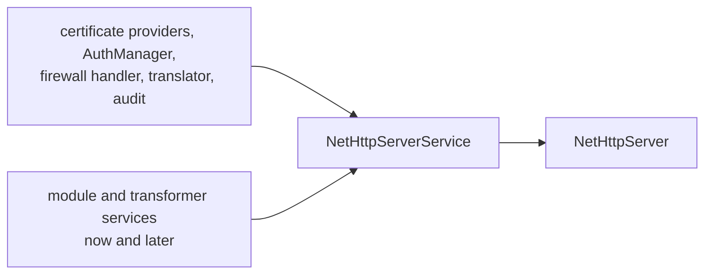

# SysWeaver.MicroService.NetHttpServer

[⬆ SysWeaver overview](../README.md)

> Micro service that runs the HttpListener-based SysWeaver web server.

| | |
|---|---|
| **Layer** | HTTP (service integration) |
| **Kind** | Micro service |

## Purpose

Declare a web server in the manifest. The service creates a [SysWeaver.NetHttpServer](../SysWeaver.NetHttpServer/README.md), wires it with everything registered in the service manager (certificates, auth, firewall, translator, audit, modules, transformers) and starts it.

## How it fits into SysWeaver



## Limitations and considerations

- Dependencies that are looked up once at construction must be registered before this service.
- See [SysWeaver.NetHttpServer](../SysWeaver.NetHttpServer/README.md) for HttpListener specific limitations.

## Using it

```json
{ "Type": "SysWeaver.MicroService.NetHttpServerService, SysWeaver.MicroService.NetHttpServer",
  "Params": { "ListenOn": [ { "Prefix": "http://localhost:8080" } ] } }
```

## Relationships

- **Project:** [`SysWeaver.MicroService.NetHttpServer.csproj`](SysWeaver.MicroService.NetHttpServer.csproj)
- **Builds on:** [SysWeaver.Auth.Core](../SysWeaver.Auth.Core/README.md), [SysWeaver.HttpServer](../SysWeaver.HttpServer/README.md), [SysWeaver.MicroService.HttpServer](../SysWeaver.MicroService.HttpServer/README.md), [SysWeaver.MicroServices.ServiceManager](../SysWeaver.MicroServices.ServiceManager/README.md), [SysWeaver.NetHttpServer](../SysWeaver.NetHttpServer/README.md)
