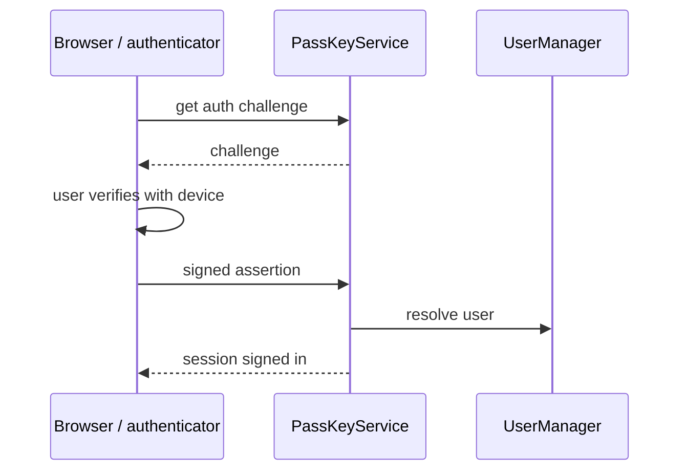

# SysWeaver.MicroService.PassKey

[⬆ SysWeaver overview](../README.md)

> Passwordless login with passkeys (WebAuthn / FIDO2), including adding a passkey from another device via QR code.

| | |
|---|---|
| **Layer** | Security / Users |
| **Kind** | Micro service |

## Purpose

Offer phishing-resistant, passwordless sign-in for accounts managed by the user manager, using the platform authenticators of browsers and phones.

## How it fits into SysWeaver



## Key features

- Discoverable (user-less) and user-specific passkey login.
- Attaching passkeys to the signed-in account.
- Cross-device enrolment through a QR code link and short-lived challenges.

## Limitations and considerations

- The relying party id and allowed origins must match your public domain; the shipped default id is the author's domain and must be changed.
- Depends on the vendored fido2-net-lib and on [SysWeaver.MicroService.UserManager](../SysWeaver.MicroService.UserManager/README.md).
- WebAuthn requires HTTPS (except on localhost).

## Using it

```json
{ "Type": "SysWeaver.MicroService.PassKeyService, SysWeaver.MicroService.PassKey",
  "Params": { "RpId": "login.example.org", "RpName": "Example" } }
```

## Relationships

- **Project:** [`SysWeaver.MicroService.PassKey.csproj`](SysWeaver.MicroService.PassKey.csproj)
- **Builds on:** [SysWeaver.MicroService.Auth](../SysWeaver.MicroService.Auth/README.md), [SysWeaver.MicroService.UserManager](../SysWeaver.MicroService.UserManager/README.md)
- **Vendored libraries:** Fido2 (see [_external](../_external/README.md))
