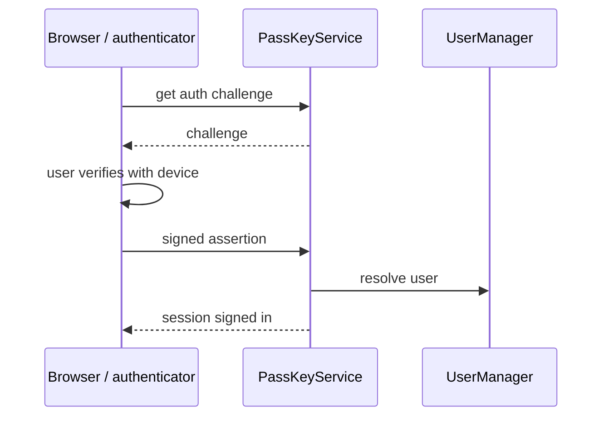

# SysWeaver.MicroService.PassKey

[⬆ SysWeaver overview](../README.md)

> Passwordless login with passkeys (WebAuthn / FIDO2), including adding a passkey from another device via QR code.

| | |
|---|---|
| **Layer** | Security / Users |
| **Kind** | Micro service |

## Purpose

Offer phishing-resistant, passwordless sign-in for accounts managed by the user manager, using the platform authenticators of browsers and phones.

## How it fits into SysWeaver



## Key features

- Discoverable (user-less) passkey sign in (any passkey for the site, including synced passkeys and passkeys on a phone), and user-specific sign in (after entering a user id, also works with non-discoverable credentials).
- Adding passkeys to the signed-in account, to an account using a link token (QR code, reset password, add password) and creating a new account with a passkey (sign up).
- Cross-device enrolment through a single-use QR code link.
- Per challenge state with a server side expiry (several tabs can sign in at the same time).
- Stores the signature counter (clone detection), transports, backup state, provider (AAGUID) and a friendly name per passkey; API to list, rename and remove passkeys (the last sign in method of a user can't be removed).

## Limitations and considerations

- The origin and relying party id are taken from the request: passkeys work on https (and http://localhost), not on ip addresses. Behind a proxy that changes the scheme or host, add the public origins to `Prefixes`.
- Passkeys are bound to the host they were created on, unless `RpId` is set to a registrable domain (ex: "example.org"), then they work on that domain and all its sub domains. Changing `RpId` invalidates existing passkeys.
- User verification (PIN / biometrics) and discoverable credentials are required by default (`UserVerification`, `ResidentKey`).
- Depends on the [Fido2](https://www.nuget.org/packages/Fido2) NuGet package (fido2-net-lib) and on [SysWeaver.MicroService.UserManager](../SysWeaver.MicroService.UserManager/README.md).

## Using it

```json
{ "Type": "SysWeaver.MicroService.PassKeyService, SysWeaver.MicroService.PassKey",
  "Params": { "RpName": "Example", "RpId": "example.org", "Prefixes": [ "https://login.example.org" ] } }
```

All parameters are optional, see `PassKeyParams` (`ChallengeLifeTime`, `RpId`, `RpName`, `UserVerification`, `ResidentKey`, `Prefixes`).

## Relationships

- **Project:** [`SysWeaver.MicroService.PassKey.csproj`](SysWeaver.MicroService.PassKey.csproj)
- **Builds on:** [SysWeaver.MicroService.Auth](../SysWeaver.MicroService.Auth/README.md), [SysWeaver.MicroService.UserManager](../SysWeaver.MicroService.UserManager/README.md)
- **NuGet packages:** [Fido2](https://www.nuget.org/packages/Fido2) 4.2.0
