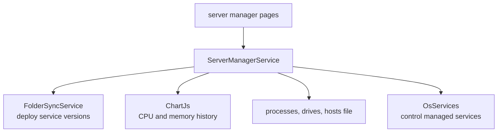

# SysWeaver.MicroService.ServerManager

[⬆ SysWeaver overview](../README.md)

> Remote server administration for SysWeaver hosts: manage deployed SysWeaver services and folders (versions, backups), watch processes, CPU, memory and drives, view text files and hosts, and reboot.

| | |
|---|---|
| **Layer** | Administration |
| **Kind** | Micro service |

## Purpose

Operate a fleet of SysWeaver machines from the browser: deploy new service versions through folder sync, keep backups, and monitor the host.

## How it fits into SysWeaver

## Limitations and considerations

- Powerful operations (kill processes, reboot, edit hosts) — restrict to administrators.
- Not included in the main solution file.

## Relationships

- **Project:** [`SysWeaver.MicroService.ServerManager.csproj`](SysWeaver.MicroService.ServerManager.csproj)
- **Builds on:** [SysWeaver.MicroService.ChartJs](../SysWeaver.MicroService.ChartJs/README.md), [SysWeaver.MicroService.FileUploader](../SysWeaver.MicroService.FileUploader/README.md), [SysWeaver.MicroService.FolderSync](../SysWeaver.MicroService.FolderSync/README.md), [SysWeaver.MicroServices.ServiceManager](../SysWeaver.MicroServices.ServiceManager/README.md), [SysWeaver.OsServices](../SysWeaver.OsServices/README.md)
