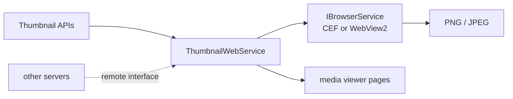

# SysWeaver.MicroService.Thumbnail.Web

[⬆ SysWeaver overview](../README.md)

> Thumbnails and screenshots of *web* content — image and video URLs, YouTube videos, Google Maps positions, media effects and arbitrary web pages — rendered with a headless browser.

| | |
|---|---|
| **Layer** | Media |
| **Kind** | Micro service (`IThumbnailWebService`) |

## Purpose

Produce preview images for links (e.g. in chat or content lists) by actually rendering them, and offer a screenshot service.

## How it fits into SysWeaver

## Limitations and considerations

- Requires a headless browser implementation, which is Windows-oriented in this repository ([SysWeaver.WebBrowser.Cef](../SysWeaver.WebBrowser.Cef/README.md), [SysWeaver.WebBrowser.WebView2](../SysWeaver.WebBrowser.WebView2/README.md)).
- Rendering arbitrary URLs has security implications (server-side request forgery); restrict access through its runtime-configurable auth.
- Concurrency is limited; rendering is slow compared to image processing.

## Relationships

- **Project:** [`SysWeaver.MicroService.Thumbnail.Web.csproj`](SysWeaver.MicroService.Thumbnail.Web.csproj)
- **Builds on:** [SysWeaver.HttpServer](../SysWeaver.HttpServer/README.md), [SysWeaver.Media](../SysWeaver.Media/README.md), [SysWeaver.MicroService.FileUploader](../SysWeaver.MicroService.FileUploader/README.md), [SysWeaver.MicroService.Media](../SysWeaver.MicroService.Media/README.md), [SysWeaver.MicroServices.ServiceManager](../SysWeaver.MicroServices.ServiceManager/README.md), [SysWeaver.WebBrowser](../SysWeaver.WebBrowser/README.md)
