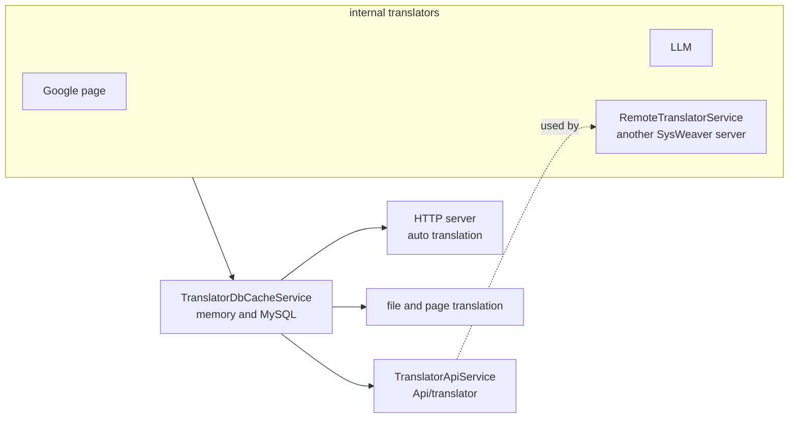

# SysWeaver.MicroService.Translation

[⬆ SysWeaver overview](../README.md)

> Translation as a web API, and translation *from* another server: exposes the process's translator over HTTP and provides a remote translator client with memory caching.

| | |
|---|---|
| **Layer** | Translation |
| **Kind** | Micro services |

## Purpose

Centralise translation: one server owns the translation back-ends and caches; other servers and browser pages use it through an API.

## How it fits into SysWeaver — the translation pipeline

## Key features

- Translate single texts, multiple texts and to multiple languages; language validation and lists of supported languages.
- Runtime-configurable endpoint permissions.
- Remote translator with in-memory caching, so a fleet of servers can share one translation back-end.
- Debug tables of supported languages.

## Limitations and considerations

- Relies on a registered translator; quality depends on the back-end.
- Public translation endpoints can incur cost if left open — configure their auth.

## Relationships

- **Project:** [`SysWeaver.MicroService.Translation.csproj`](SysWeaver.MicroService.Translation.csproj)
- **Builds on:** [SysWeaver.Common](../SysWeaver.Common/README.md), [SysWeaver.FileTranslation](../SysWeaver.FileTranslation/README.md), [SysWeaver.IsoData](../SysWeaver.IsoData/README.md), [SysWeaver.MicroServices.ServiceManager](../SysWeaver.MicroServices.ServiceManager/README.md)
