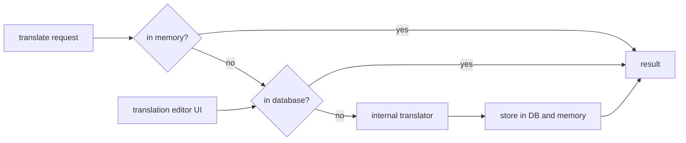

# SysWeaver.MicroService.TranslationDbCache

[⬆ SysWeaver overview](../README.md)

> The caching front of the translation pipeline: an `ITranslator` that serves translations from memory and MySQL and asks internal translators only for new texts. Includes a translation editor.

| | |
|---|---|
| **Layer** | Translation |
| **Kind** | Micro service (`ITranslator`) |

## Purpose

Translate each distinct text once, keep the result, and let people correct it. This is the translator the HTTP server and other services should use.

## How it fits into SysWeaver

## Key features

- Two-level cache (memory, MySQL).
- Browse, inspect, override and delete translations from a web editor.

## Limitations and considerations

- Requires MySQL and at least one internal translator registered before it.

## Relationships

- **Project:** [`SysWeaver.MicroService.TranslationDbCache.csproj`](SysWeaver.MicroService.TranslationDbCache.csproj)
- **Builds on:** [SysWeaver.Common](../SysWeaver.Common/README.md), [SysWeaver.Compression](../SysWeaver.Compression/README.md), [SysWeaver.DbSimpleStack.MySql](../SysWeaver.DbSimpleStack.MySql/README.md), [SysWeaver.IsoData](../SysWeaver.IsoData/README.md), [SysWeaver.MicroServices.ServiceManager](../SysWeaver.MicroServices.ServiceManager/README.md)
