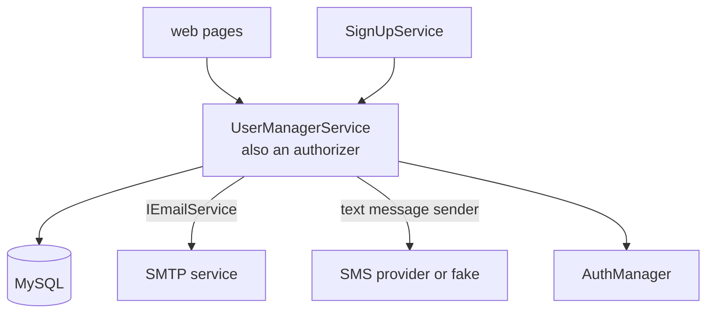
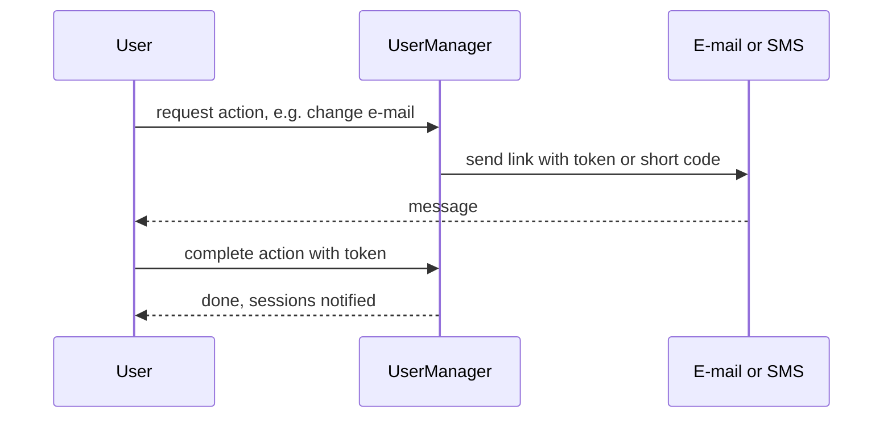

# SysWeaver.MicroService.UserManager

[⬆ SysWeaver overview](../README.md)

> Self-service user accounts on MySQL: sign-up and invitations, passwords, e-mail and phone verification, nick names and account deletion — all driven by action tokens or short codes sent through e-mail/SMS with localized templates.

| | |
|---|---|
| **Layer** | Security / Users |
| **Kind** | Micro services (an authorizer + sign-up service) |

## Purpose

Provide a complete account lifecycle for public-facing applications. The user manager is itself an authorizer, so accounts it manages can log in through the standard [SysWeaver.MicroService.Auth](../SysWeaver.MicroService.Auth/README.md) flow.

## How it fits into SysWeaver



### Action token pattern



## Key features

- Sign-up (when enabled), invitations and administrative user tables.
- Password set/reset/forgot flows with policy enforcement; forced reset.
- Multiple communication methods per user (e-mail and phone) with verification.
- Numeric short codes as an alternative to links.
- Localized message templates (HTML and text) with a folder-per-language layout.
- Can be used for identity data without allowing login through it.

## Limitations and considerations

- Requires MySQL and, for most flows, an e-mail service and/or SMS sender.
- Message templates must be provided/adapted for your product and languages.
- One role constant for viewing users is built by string concatenation without a separating comma, which merges two role names (see source); verify the effective auth of administrative endpoints.

## Using it

```json
{ "Type": "SysWeaver.MicroService.UserManagerService, SysWeaver.MicroService.UserManager",
  "Params": { "Server": "db.local", "Schema": "users", "User": "svc", "Password": "…" } }
```
Register it (and the e-mail/SMS services) together with the auth services.

## Relationships

- **Project:** [`SysWeaver.MicroService.UserManager.csproj`](SysWeaver.MicroService.UserManager.csproj)
- **Builds on:** [SysWeaver.Common](../SysWeaver.Common/README.md), [SysWeaver.DbSimpleStack.MySql](../SysWeaver.DbSimpleStack.MySql/README.md), [SysWeaver.HttpServer](../SysWeaver.HttpServer/README.md), [SysWeaver.MicroService.Auth](../SysWeaver.MicroService.Auth/README.md), [SysWeaver.MicroServices.ServiceManager](../SysWeaver.MicroServices.ServiceManager/README.md), [SysWeaver.MicroServices](../SysWeaver.MicroServices/README.md)
- **Used by:** [SysWeaver.MicroService.PassKey](../SysWeaver.MicroService.PassKey/README.md)
