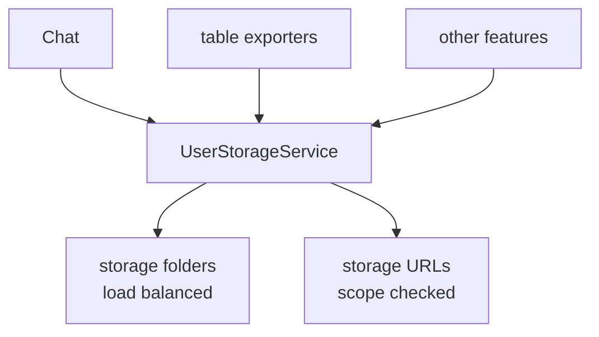

# SysWeaver.MicroService.UserStorage

[⬆ SysWeaver overview](../README.md)

> Per-user file and link storage with access scopes (private, protected, public), retention, multi-disc distribution and on-disc compression.

| | |
|---|---|
| **Layer** | Users / Storage |
| **Kind** | Micro service (`IUserStorageService`) |

## Purpose

A shared place where features can persist files on behalf of users — for example files and links shared in chat, or exported tables — with consistent permissions and lifetime.

## How it fits into SysWeaver

## Key features

- Access scopes controlling who may read stored items; uploads per scope can be enabled independently.
- Retention plans for automatic clean-up.
- Compression of suitable file types on disc.
- Stored links (URL snapshots) in addition to files.

## Limitations and considerations

- File system based; capacity and backups are the operator's responsibility.
- Public scope makes content reachable without sign-in — enable deliberately.

## Relationships

- **Project:** [`SysWeaver.MicroService.UserStorage.csproj`](SysWeaver.MicroService.UserStorage.csproj)
- **Builds on:** [SysWeaver.Auth.Core](../SysWeaver.Auth.Core/README.md), [SysWeaver.Common](../SysWeaver.Common/README.md), [SysWeaver.HttpServer](../SysWeaver.HttpServer/README.md), [SysWeaver.MicroService.FileUploader](../SysWeaver.MicroService.FileUploader/README.md), [SysWeaver.MicroServices.ServiceManager](../SysWeaver.MicroServices.ServiceManager/README.md)
