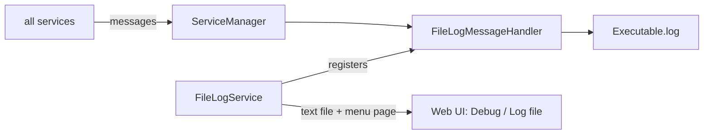

# SysWeaver.MicroServices.Log

[⬆ SysWeaver overview](../README.md)

> A micro service that writes all application messages to a size-limited log file and makes that file available in the web UI.

| | |
|---|---|
| **Layer** | Runtime |
| **Kind** | Micro service |

## Purpose

Persist the message stream of the `ServiceManager` to disk with zero code — just a manifest entry — and let operators read the log through the web interface.

## How it fits into SysWeaver



## Key features

- Log file path from a path template (defaults to the executable's base name).
- Style and sync/async write mode selectable.
- Automatic truncation when the file grows beyond a size limit.
- Log file exposed as a viewable text file (admin/ops) and as a web page in the debug menu.
- Optional dump of all statistics tables when the service shuts down.

## Limitations and considerations

- Truncation keeps the newer half of the file; it is not a rotating archive.
- Only messages produced after the service is registered are written — list it first in the manifest.

## Using it

```json
{ "Type": "SysWeaver.MicroService.FileLogService, SysWeaver.MicroServices.Log" }
```

## Relationships

- **Project:** [`SysWeaver.MicroServices.Log.csproj`](SysWeaver.MicroServices.Log.csproj)
- **Builds on:** [SysWeaver.Common](../SysWeaver.Common/README.md), [SysWeaver.MicroServices.ServiceManager](../SysWeaver.MicroServices.ServiceManager/README.md)
