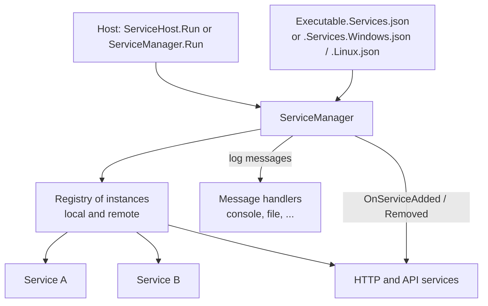
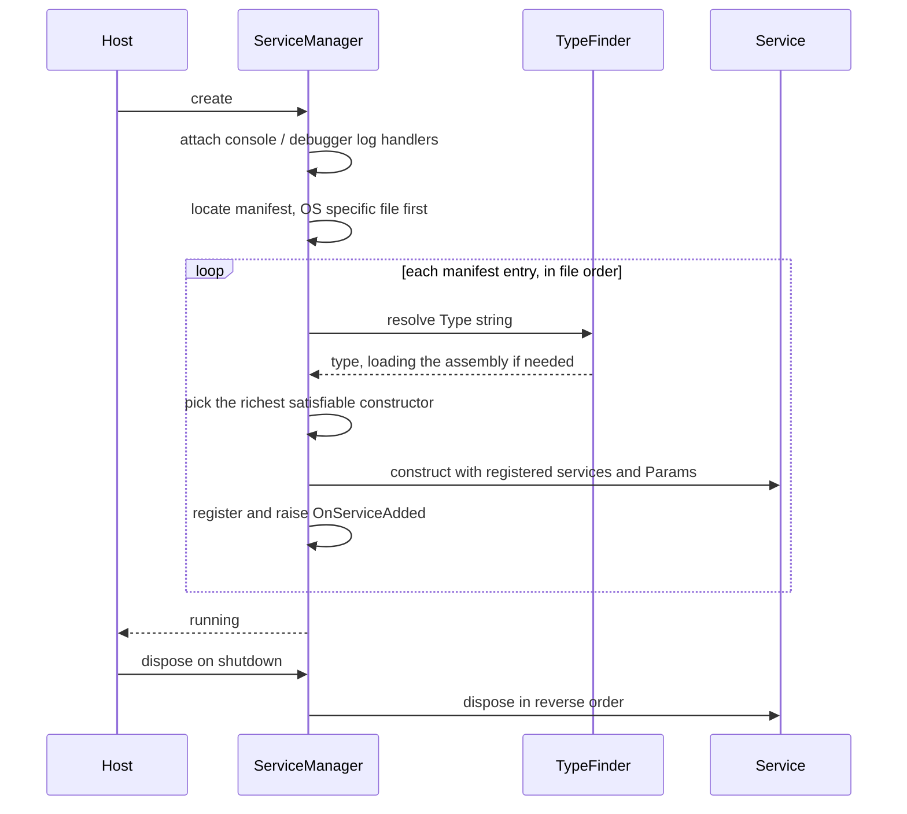

# SysWeaver.MicroServices.ServiceManager

[⬆ SysWeaver overview](../README.md)

> The composition root and runtime registry of every SysWeaver application: it reads the service manifest, constructs services through constructor injection, owns their lifetime, routes messages between them, and exposes the running system for diagnostics.

| | |
|---|---|
| **Layer** | Runtime |
| **Kind** | Core library + built-in services |

## Purpose

In SysWeaver an application is *configured*, not *coded*: the executable is little more than a host, and the set of running services is described in a JSON manifest. The `ServiceManager` turns that manifest into a live object graph and keeps track of it for the lifetime of the process.

## How it fits into SysWeaver



### Startup sequence



## Key concepts

| Concept | Description |
|---|---|
| **Manifest** | An ordered JSON array of entries `{ Type, Name, Params }`. Comments and trailing commas are allowed. An OS-specific manifest takes precedence over the generic one. |
| **Constructor injection** | Constructor parameters are satisfied from already registered services (single instances or collections of all matching instances), the manager itself, and — for the remaining parameter — the entry's `Params` object. |
| **Special entry kinds** | Serializer and compression plug-ins are *registered* (static registration) instead of instantiated; an interface type with remote connection parameters becomes a generated remote proxy. |
| **Instances and names** | Services can be named; lookups can filter local vs. remote instances and choose oldest/newest. |
| **Lifetime** | Services created by the manager are owned and disposed in reverse registration order. |
| **Events** | Added/removed notifications let infrastructure services (HTTP, API, auth) attach to services registered later. |
| **Manifest editing** | The manifest can be read into typed entries and written back, which the web admin UI uses to view and edit server configuration. |

## Key features

- Configuration-driven composition with no DI container setup code.
- Mixed local and remote services behind the same interfaces.
- Central logging hub (the manager is a message host).
- Pause/resume propagated to services, controlled process restart.
- Service-to-service messaging (post a keyed message to all listeners).
- Automatic collection of statistics and performance data from all services, published as web tables (services, stats, performance, scheduled tasks).
- One-time pads, file extension editor/viewer registry and text-file access used by other framework services.
- Built-in services for process CPU control (priority, affinity / core slicing) and for waiting until the machine has a LAN address.

## Limitations and considerations

- **Order matters.** Services are created strictly in manifest order and a constructor only sees services registered before it. Infrastructure that looks up dependencies once in its constructor (e.g. the HTTP server and the auth manager) must come after those dependencies. See the ordering rules in the [SysWeaver overview](../README.md).
- A failing entry aborts manifest loading (with a message listing unresolved types); combine with the auto-recovery of [SysWeaver.OsServices](../SysWeaver.OsServices/README.md) for resilience.
- Constructor selection is by parameter count and resolvability, not by attributes; ambiguous constructors can pick an unexpected overload.
- Type strings should be assembly-qualified (`"Namespace.Type, Assembly"`), otherwise the type is only found if its assembly happens to be loaded already.

## Using it

```csharp
// Console host: runs until Ctrl+C / SIGTERM, loading <exe>.Services.json
await SysWeaver.MicroService.ServiceManager.Run("MyApp");
```

```json
[
  { "Type": "SysWeaver.MicroService.FileLogService, SysWeaver.MicroServices.Log" },
  { "Type": "MyApp.OrderService, MyApp", "Name": "orders", "Params": { } }
]
```

Inside a service:

```csharp
public OrderService(ServiceManager manager, OrderParams p)
{
    var mail = manager.TryGet<IEmailService>();      // optional dependency
    manager.OnServiceAdded += (s, info) => { /* react to late services */ };
}
```

## Relationships

- **Project:** [`SysWeaver.MicroServices.ServiceManager.csproj`](SysWeaver.MicroServices.ServiceManager.csproj)
- **Builds on:** [SysWeaver.CommandLine](../SysWeaver.CommandLine/README.md), [SysWeaver.Common](../SysWeaver.Common/README.md), [SysWeaver.HttpServer](../SysWeaver.HttpServer/README.md), [SysWeaver.MicroServices](../SysWeaver.MicroServices/README.md), [SysWeaver.Remote.Connection](../SysWeaver.Remote.Connection/README.md), [SysWeaver.TableData](../SysWeaver.TableData/README.md)
- **Used by:** [SysWeaver.AI.OpenAI](../SysWeaver.AI.OpenAI/README.md), [SysWeaver.Chat](../SysWeaver.Chat/README.md), [SysWeaver.ExchangeRate](../SysWeaver.ExchangeRate/README.md), [SysWeaver.IpLocation](../SysWeaver.IpLocation/README.md), [SysWeaver.MicroService.AspHttpServer](../SysWeaver.MicroService.AspHttpServer/README.md), [SysWeaver.MicroService.Auth](../SysWeaver.MicroService.Auth/README.md), [SysWeaver.MicroService.ChartJs](../SysWeaver.MicroService.ChartJs/README.md), [SysWeaver.MicroService.ChartJs.Excel](../SysWeaver.MicroService.ChartJs.Excel/README.md), [SysWeaver.MicroService.Edit](../SysWeaver.MicroService.Edit/README.md), [SysWeaver.MicroService.FileUploader](../SysWeaver.MicroService.FileUploader/README.md), [SysWeaver.MicroService.FolderSync](../SysWeaver.MicroService.FolderSync/README.md), [SysWeaver.MicroService.HttpServer](../SysWeaver.MicroService.HttpServer/README.md), [SysWeaver.MicroService.LanCertificateManager](../SysWeaver.MicroService.LanCertificateManager/README.md), [SysWeaver.MicroService.Media](../SysWeaver.MicroService.Media/README.md), [SysWeaver.MicroService.MediaThumbnail](../SysWeaver.MicroService.MediaThumbnail/README.md), [SysWeaver.MicroService.MySqlAudit](../SysWeaver.MicroService.MySqlAudit/README.md), [SysWeaver.MicroService.NetHttpServer](../SysWeaver.MicroService.NetHttpServer/README.md), [SysWeaver.MicroService.QR](../SysWeaver.MicroService.QR/README.md), [SysWeaver.MicroService.ServerManager](../SysWeaver.MicroService.ServerManager/README.md), [SysWeaver.MicroService.Thumbnail](../SysWeaver.MicroService.Thumbnail/README.md), [SysWeaver.MicroService.Thumbnail.Web](../SysWeaver.MicroService.Thumbnail.Web/README.md), [SysWeaver.MicroService.Translation](../SysWeaver.MicroService.Translation/README.md), [SysWeaver.MicroService.TranslationDbCache](../SysWeaver.MicroService.TranslationDbCache/README.md), [SysWeaver.MicroService.UserManager](../SysWeaver.MicroService.UserManager/README.md), [SysWeaver.MicroService.UserStorage](../SysWeaver.MicroService.UserStorage/README.md), [SysWeaver.MicroServices.Log](../SysWeaver.MicroServices.Log/README.md), [SysWeaver.OsServices](../SysWeaver.OsServices/README.md), [SysWeaver.OsServices.ServiceHostFactoryUnix](../SysWeaver.OsServices.ServiceHostFactoryUnix/README.md), [SysWeaver.OsServices.ServiceHostFactoryWin32NT](../SysWeaver.OsServices.ServiceHostFactoryWin32NT/README.md), [SysWeaver.ReverseProxy](../SysWeaver.ReverseProxy/README.md), [SysWeaver.TextMessage.Fake](../SysWeaver.TextMessage.Fake/README.md)
