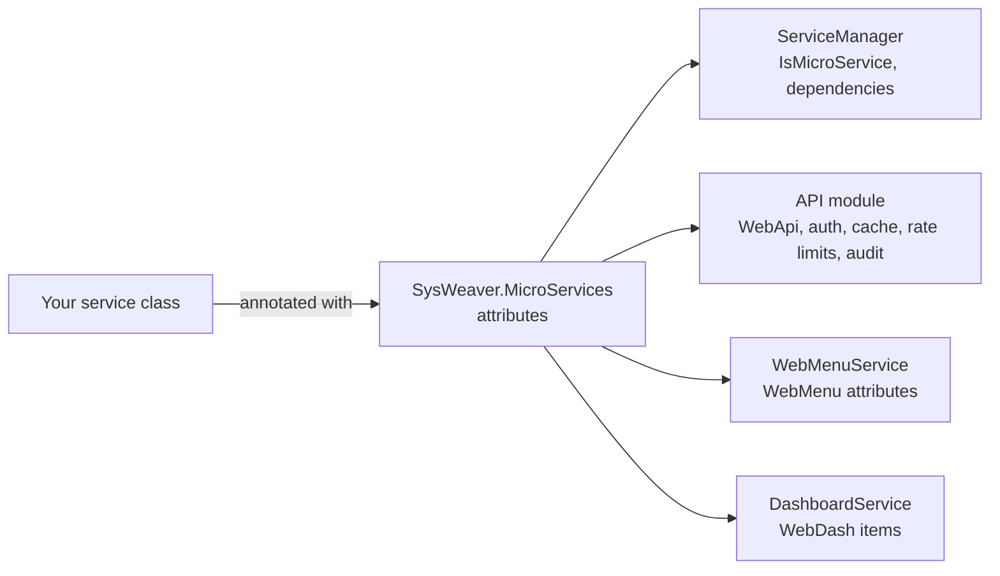

# SysWeaver.MicroServices

[⬆ SysWeaver overview](../README.md)

> The declarative vocabulary for writing SysWeaver services: attributes that mark a class as a micro service, publish methods as web APIs, add menu entries and dashboards, and describe dependencies — plus a handful of cross-service interfaces.

| | |
|---|---|
| **Layer** | Contracts |
| **Kind** | Attribute and interface library (no runtime logic) |

## Purpose

A service author should be able to write a plain C# class and *annotate* it, instead of registering routes, menus or dependencies in code. This project defines those annotations. The behaviour behind them lives elsewhere: the [SysWeaver.MicroServices.ServiceManager](../SysWeaver.MicroServices.ServiceManager/README.md) creates services, [SysWeaver.HttpServer](../SysWeaver.HttpServer/README.md) turns `[WebApi]` methods into endpoints, and [SysWeaver.MicroService.HttpServer](../SysWeaver.MicroService.HttpServer/README.md) builds menus and dashboards.

## How it fits into SysWeaver



## Key concepts

| Group | Meaning |
|---|---|
| **Service declaration** | `[IsMicroService]` marks intent; `[RequiredDep]` / `[OptionalDep]` document which other services must or may be registered. |
| **Web API publishing** | `[WebApi]` publishes a method; `[WebApiUrl]` sets the path prefix of a class; `[WebApiAuth]` sets required tokens (none, any signed-in user, or a list of roles). |
| **Response policy** | Client cache, server-side request cache (global or per session), preferred compression, raw (pre-serialized) responses. |
| **Protection and accountability** | Per-service and per-session rate limits, auditing of calls (with optional filtering of logged parameters/results), optional APIs that are only published when a flag on the instance is set. |
| **Navigation** | `[WebMenu*]` attributes place links, tables, charts, embedded pages or scripts into the web UI's menu tree. |
| **Dashboards** | Items (e.g. embedded iframes or inline HTML) that form user dashboards. |
| **Cross-service interfaces** | Message listeners (service-to-service notifications), runtime-configurable API auth, e-mail and QR code service contracts, template variables. |

## Key features

- Services remain plain classes: no base class is required.
- Security, caching and rate limiting are declared next to the method they apply to.
- Runtime auth overrides (`IRunTimeWebApiAuth`) let a service decide endpoint permissions from its configuration rather than at compile time.

## Limitations and considerations

- Attributes are metadata only; without the corresponding runtime projects nothing happens.
- `[IsMicroService]` and the dependency attributes document intent — the service manager will instantiate any class with a satisfiable constructor and does not enforce the declared dependencies itself; services typically enforce them in their constructors.

## Using it

```csharp
using SysWeaver;
using SysWeaver.MicroService;

[IsMicroService]
[WebApiUrl("orders")]                          // /Api/orders/...
public sealed class OrderService
{
    [WebApi]                                   // /Api/orders/Count
    [WebApiClientCache(10)]
    public int Count() => 42;

    [WebApi]
    [WebApiAuth(Roles.Ops)]                    // requires an Ops (or Debug) token
    [WebApiAudit("Orders")]
    public bool Purge() => true;
}
```

## Relationships

- **Project:** [`SysWeaver.MicroServices.csproj`](SysWeaver.MicroServices.csproj)
- **Builds on:** [SysWeaver.Common](../SysWeaver.Common/README.md)
- **Used by:** [SysWeaver.Auth.Core](../SysWeaver.Auth.Core/README.md), [SysWeaver.ExpressionEvaluator](../SysWeaver.ExpressionEvaluator/README.md), [SysWeaver.HttpServer](../SysWeaver.HttpServer/README.md), [SysWeaver.LanguageIdentifier.Llm](../SysWeaver.LanguageIdentifier.Llm/README.md), [SysWeaver.MicroService.Edit](../SysWeaver.MicroService.Edit/README.md), [SysWeaver.MicroService.FileUploader](../SysWeaver.MicroService.FileUploader/README.md), [SysWeaver.MicroService.Map](../SysWeaver.MicroService.Map/README.md), [SysWeaver.MicroService.Net](../SysWeaver.MicroService.Net/README.md), [SysWeaver.MicroService.UserManager](../SysWeaver.MicroService.UserManager/README.md), [SysWeaver.MicroServices.ServiceManager](../SysWeaver.MicroServices.ServiceManager/README.md), [SysWeaver.Remote.Services](../SysWeaver.Remote.Services/README.md)
