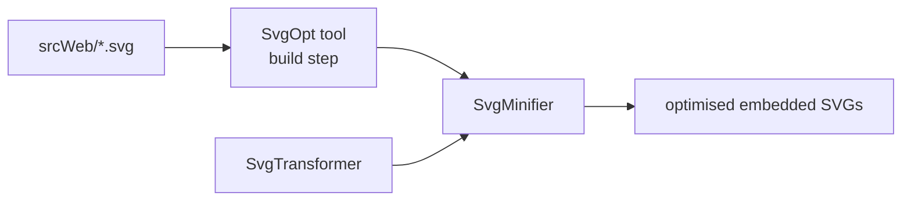

# SysWeaver.Minifier.Svg

[⬆ SysWeaver overview](../README.md)

> SVG minifier/optimiser, used at build time for all framework icons and at runtime by the SVG transformer.

| | |
|---|---|
| **Layer** | Media / Build tooling |
| **Kind** | Library |

## Purpose

Reduce SVG size and normalise icons (e.g. remove fill and size attributes so icons can be styled with CSS, limit decimals). The pre-built `SvgOpt` tool in `_tools` is built on it.

## How it fits into SysWeaver

## Limitations and considerations

- Aggressive options can remove information some SVGs depend on; options are chosen per project.
- Not included in the main solution file.

## Relationships

- **Project:** [`SysWeaver.Minifier.Svg.csproj`](SysWeaver.Minifier.Svg.csproj)
- **Builds on:** [SysWeaver.Common](../SysWeaver.Common/README.md)
- **Used by:** [SysWeaver.HttpTransformer.Svg](../SysWeaver.HttpTransformer.Svg/README.md)
