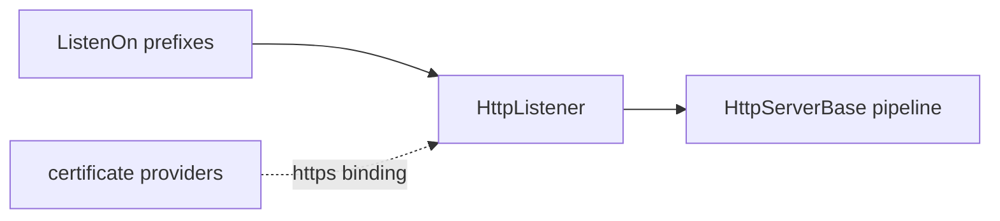

# SysWeaver.NetHttpServer

[⬆ SysWeaver overview](../README.md)

> HTTP listener adapter for the SysWeaver pipeline based on `System.Net.HttpListener`.

| | |
|---|---|
| **Layer** | HTTP |
| **Kind** | Library (concrete server) |

## Purpose

The lightweight, dependency-free way to host the SysWeaver HTTP pipeline. It listens on the configured prefixes and forwards each request to [SysWeaver.HttpServer](../SysWeaver.HttpServer/README.md).

## How it fits into SysWeaver

## Key features

- Validates each prefix and can skip prefixes that fail to bind instead of failing the server.
- Graceful shutdown waiting for pending requests.
- Pause mode answering requests without processing.

## Limitations and considerations

- HttpListener on Windows requires administrator rights or URL reservations for non-localhost prefixes, and HTTPS binding is done through Windows tooling.
- For cross-platform HTTPS or HTTP/3 prefer [SysWeaver.AspHttpServer](../SysWeaver.AspHttpServer/README.md).

## Using it

Through [SysWeaver.MicroService.NetHttpServer](../SysWeaver.MicroService.NetHttpServer/README.md).

## Relationships

- **Project:** [`SysWeaver.NetHttpServer.csproj`](SysWeaver.NetHttpServer.csproj)
- **Builds on:** [SysWeaver.HttpServer](../SysWeaver.HttpServer/README.md)
- **Used by:** [SysWeaver.MicroService.NetHttpServer](../SysWeaver.MicroService.NetHttpServer/README.md), [SysWeaver.Security.Acme](../SysWeaver.Security.Acme/README.md)
