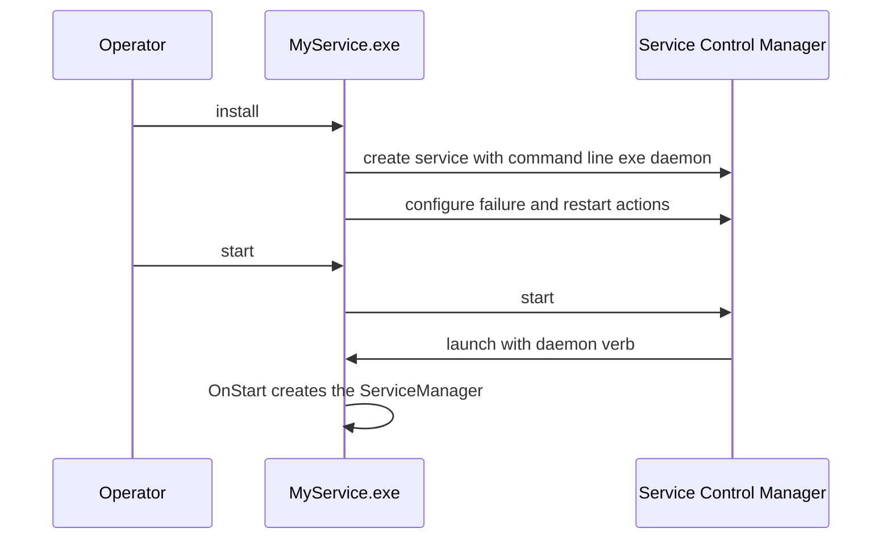

# SysWeaver.OsServices.ServiceHostFactoryWin32NT

[⬆ SysWeaver overview](../README.md)

> Windows back-end for `ServiceHost`: installs, configures and runs the application as a Windows service.

| | |
|---|---|
| **Layer** | Hosting (platform adapter) |
| **Kind** | Library, resolved by name at runtime |
| **Platform** | Windows |

## Purpose

Implements the service host contract of [SysWeaver.OsServices](../SysWeaver.OsServices/README.md) on top of the Windows Service Control Manager and `System.ServiceProcess`.

## How it fits into SysWeaver

## Key features

- Service registration with display name, description and restart-on-failure actions.
- Elevation through the standard Windows "run as administrator" mechanism.
- Start/stop/pause/continue mapped onto the service manager.

## Limitations and considerations

- Windows only; must be referenced or deployed with the executable so `ServiceHost` can find it.

## Using it

Reference it from your executable project; everything else is driven by `ServiceHost.Run` and the command line verbs.

## Relationships

- **Project:** [`SysWeaver.OsServices.ServiceHostFactoryWin32NT.csproj`](SysWeaver.OsServices.ServiceHostFactoryWin32NT.csproj)
- **Builds on:** [SysWeaver.MicroServices.ServiceManager](../SysWeaver.MicroServices.ServiceManager/README.md), [SysWeaver.OsServices](../SysWeaver.OsServices/README.md)
