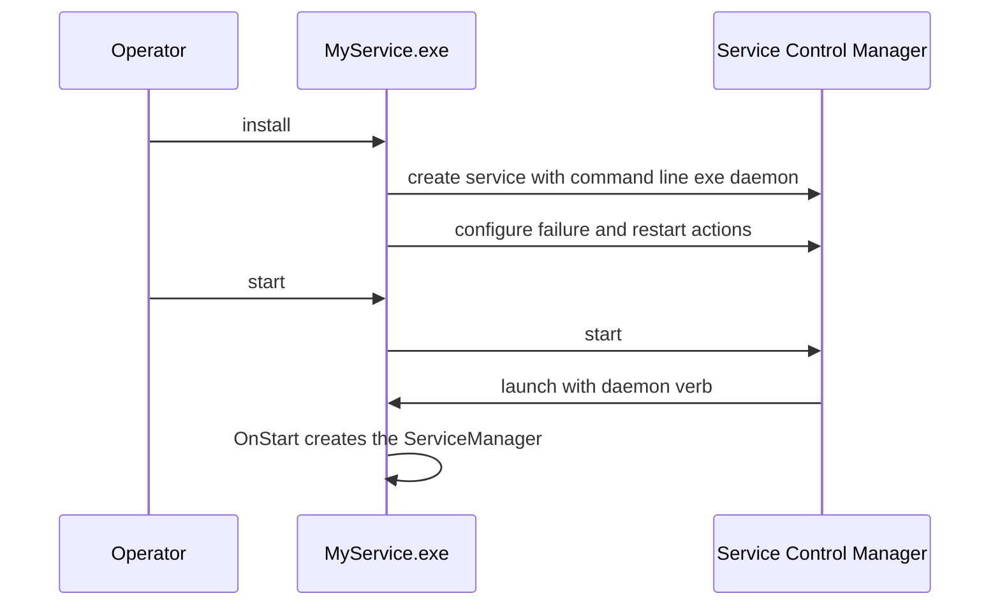

# SysWeaver.OsServices.ServiceHostFactoryWin32NT

[⬆ SysWeaver overview](../README.md)

> Windows back-end for `ServiceHost`: installs, configures and runs the application as a Windows service.

| | |
|---|---|
| **Layer** | Hosting (platform adapter) |
| **Kind** | Library, resolved by name at runtime |
| **Platform** | Windows |

## Purpose

Implements the service host contract of [SysWeaver.OsServices](../SysWeaver.OsServices/README.md) on top of the Windows Service Control Manager and `System.ServiceProcess`.

## How it fits into SysWeaver

## Key features

- Service registration (own process, LocalSystem, command line `[exe] daemon`) with display name, description, start-up type (disabled, manual, automatic or delayed automatic) and restart-on-failure actions (restart on 1st/2nd failure after `RestartDelaySeconds`, later failures after `RestartDelayLastSeconds`).
- Elevation through the standard Windows "run as administrator" mechanism (`runas` verb, UAC prompt).
- Start/stop/pause/continue mapped onto the service manager (`ServiceBase` pause/continue/stop/shutdown pause, resume or dispose all services).
- Direct advapi32 interop (`Win32ServiceManager`, internal) for install, uninstall, configuration and control.

| Type | Role |
|---|---|
| `ServiceHostFactoryWin32NT` | `IServiceHostFactory` found by name by `ServiceHost.Run` |
| `ElevatedProcessWin32NT` | `IsElevated` (Administrators role) and `RunElevated` |
| `ServiceHostWindows`, `ServiceInstance`, `Win32ServiceManager` | Internal `IServiceHost`, `ServiceBase` and SCM interop implementations |

## Limitations and considerations

- Windows only; must be referenced or deployed with the executable so `ServiceHost` can find it.
- The service always runs as LocalSystem; change the account in the Services console if needed.
- `start` does not resume a paused service (use `continue`).
- `uninstall` marks the service for deletion; Windows removes it once all handles are closed.

## Using it

Reference it from your executable project; everything else is driven by `ServiceHost.Run` and the command line verbs.

## Relationships

- **Project:** [`SysWeaver.OsServices.ServiceHostFactoryWin32NT.csproj`](SysWeaver.OsServices.ServiceHostFactoryWin32NT.csproj)
- **Builds on:** [SysWeaver.MicroServices.ServiceManager](../SysWeaver.MicroServices.ServiceManager/README.md), [SysWeaver.OsServices](../SysWeaver.OsServices/README.md)
