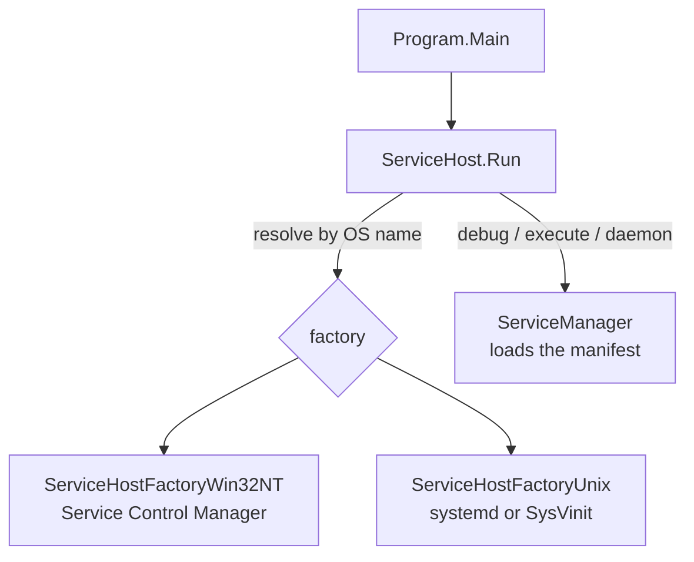

# SysWeaver.OsServices

[⬆ SysWeaver overview](../README.md)

> Turns a SysWeaver application into a proper operating-system service — Windows service, systemd unit or SysVinit script — controlled with simple command line verbs, with an interactive console mode and automatic recovery from broken manifests.

| | |
|---|---|
| **Layer** | Hosting |
| **Kind** | Library (host entry point) |
| **Platform** | Windows and Linux (via factory assemblies) |

## Purpose

Writing and installing services is repetitive and OS specific. `ServiceHost.Run` makes it a one-liner: the same executable can be installed, controlled, debugged in a console, and run by the OS service manager.

## How it fits into SysWeaver



### Verb model

| Verb | Effect |
|---|---|
| `install`, `uninstall`, `reinstall` | Register/remove the OS service (elevation is requested when needed) |
| `start`, `stop`, `pause`, `continue`, `restart`, `status` | Control the installed service |
| `debug` | Run in the console showing all message levels |
| `execute` | Run in the console with normal verbosity |
| `daemon` | The entry point used by the OS service manager |
| `hash [user] [password]` | Utility to compute a simple password hash for configuration |
| `help` (or none, in a console) | Usage; with no arguments and no console, `start` is used |

In console mode `Esc` stops the application and `Space` pauses/resumes all services; OS signals (SIGINT, SIGTERM, SIGHUP, SIGQUIT) trigger a graceful shutdown. Before starting, console mode waits up to 15 seconds for other processes with the same name to exit.

The process exit code is a `ServiceResponse` value (`Ok` = 1, errors are 0 or negative), or a `ServiceStatus` value for `status`.

## Key features

- One executable for install, control, debugging and production.
- OS-specific behaviour isolated in separately deployed factory assemblies.
- Restart-on-failure for the installed service: SCM failure actions on Windows (`RestartOnFail`, `RestartDelaySeconds`, ...), `Restart=always` in the systemd unit (SysVinit has none).
- Start-up mode (`ServiceStarts`: disabled, manual, normal, delayed) applied when installing (Windows).
- **Manifest auto-recovery** (`AutoRecover`): after a successful start the manifest is saved as `[Manifest].LastGood.json`; if an unhandled exception occurs during a later start-up, the current manifest is saved as `[Manifest].Replace.json`, the last good manifest is restored and the service (or console process) restarted. Overwritten manifests are backed up as `Bak_[date]_[date].[Manifest].json` (see `ServiceHost.BackupConfig` / `IsConfigBackupName`) and can be inspected from the web admin.

## Key types

| Type | Role |
|---|---|
| `ServiceHost` | `Run` entry point, plus manifest backup helpers |
| `ServiceParams` | Service name, display name, description, start mode, restart policy, logo, auto-recover |
| `ServiceVerbs` | The command line verbs |
| `ServiceResponse` / `ServiceStatus` | Operation results (exit codes) and service states, with `Text()` helpers |
| `IServiceHost` | OS specific install / control / run implementation |
| `IServiceHostFactory` | Creates the `IServiceHost`, implemented as `SysWeaver.OsServices.ServiceHostFactory[Platform]` |

## Limitations and considerations

- The OS factory assemblies are resolved by name at runtime (`SysWeaver.OsServices.ServiceHostFactory[Platform]`, already loaded or as a dll next to the executable); forgetting to reference/deploy them makes all service verbs (`install`, `start`, `status`, `daemon`, `hash`, ...) unavailable, only `debug`, `execute` and `help` work.
- Auto-recovery only reacts to unhandled exceptions during start-up, not to services that merely fail to start.
- Installing and controlling services requires administrative rights.
- Only Windows and Linux are implemented.

## Using it

```csharp
using SysWeaver.OsServices;
public static class Program
{
    public static int Main() => ServiceHost.Run(new ServiceParams
    {
        Name = "MyService", DisplayName = "My Service", Description = "…",
    });
}
```
```text
MyService debug        # develop
MyService install      # deploy
MyService start
```

## Relationships

- **Project:** [`SysWeaver.OsServices.csproj`](SysWeaver.OsServices.csproj)
- **Builds on:** [SysWeaver.MicroServices.ServiceManager](../SysWeaver.MicroServices.ServiceManager/README.md)
- **Used by:** [SysWeaver.MicroService.ServerManager](../SysWeaver.MicroService.ServerManager/README.md), [SysWeaver.OsServices.ServiceHostFactoryUnix](../SysWeaver.OsServices.ServiceHostFactoryUnix/README.md), [SysWeaver.OsServices.ServiceHostFactoryWin32NT](../SysWeaver.OsServices.ServiceHostFactoryWin32NT/README.md)
