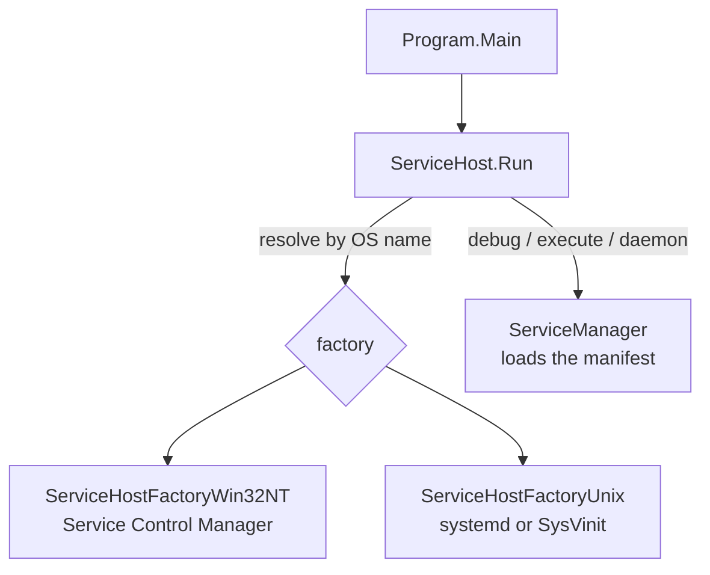

# SysWeaver.OsServices

[⬆ SysWeaver overview](../README.md)

> Turns a SysWeaver application into a proper operating-system service — Windows service, systemd unit or SysVinit script — controlled with simple command line verbs, with an interactive console mode and automatic recovery from broken manifests.

| | |
|---|---|
| **Layer** | Hosting |
| **Kind** | Library (host entry point) |
| **Platform** | Windows and Linux (via factory assemblies) |

## Purpose

Writing and installing services is repetitive and OS specific. `ServiceHost.Run` makes it a one-liner: the same executable can be installed, controlled, debugged in a console, and run by the OS service manager.

## How it fits into SysWeaver



### Verb model

| Verb | Effect |
|---|---|
| `install`, `uninstall`, `reinstall` | Register/remove the OS service (elevation is requested when needed) |
| `start`, `stop`, `pause`, `continue`, `restart`, `status` | Control the installed service |
| `debug` | Run in the console showing all message levels |
| `execute` | Run in the console with normal verbosity |
| `daemon` | The entry point used by the OS service manager |
| `hash` | Utility to compute password hashes for configuration |
| `help` (or none, in a console) | Usage |

In console mode `Esc` stops the application and `Space` pauses/resumes all services; OS signals trigger a graceful shutdown.

## Key features

- One executable for install, control, debugging and production.
- OS-specific behaviour isolated in separately deployed factory assemblies.
- Restart-on-failure policies for the installed service.
- **Manifest auto-recovery**: after a successful start the manifest is saved as "last known good"; if a later start fails, the last good manifest is restored and the process restarted. Previous versions are kept and can be inspected from the web admin.

## Limitations and considerations

- The OS factory assemblies are resolved by name at runtime; forgetting to reference/deploy them makes `install` and `daemon` unavailable.
- Installing and controlling services requires administrative rights.
- Only Windows and Linux are implemented.

## Using it

```csharp
using SysWeaver.OsServices;
public static class Program
{
    public static int Main() => ServiceHost.Run(new ServiceParams
    {
        Name = "MyService", DisplayName = "My Service", Description = "…",
    });
}
```
```text
MyService debug        # develop
MyService install      # deploy
MyService start
```

## Relationships

- **Project:** [`SysWeaver.OsServices.csproj`](SysWeaver.OsServices.csproj)
- **Builds on:** [SysWeaver.MicroServices.ServiceManager](../SysWeaver.MicroServices.ServiceManager/README.md)
- **Used by:** [SysWeaver.MicroService.ServerManager](../SysWeaver.MicroService.ServerManager/README.md), [SysWeaver.OsServices.ServiceHostFactoryUnix](../SysWeaver.OsServices.ServiceHostFactoryUnix/README.md), [SysWeaver.OsServices.ServiceHostFactoryWin32NT](../SysWeaver.OsServices.ServiceHostFactoryWin32NT/README.md)
