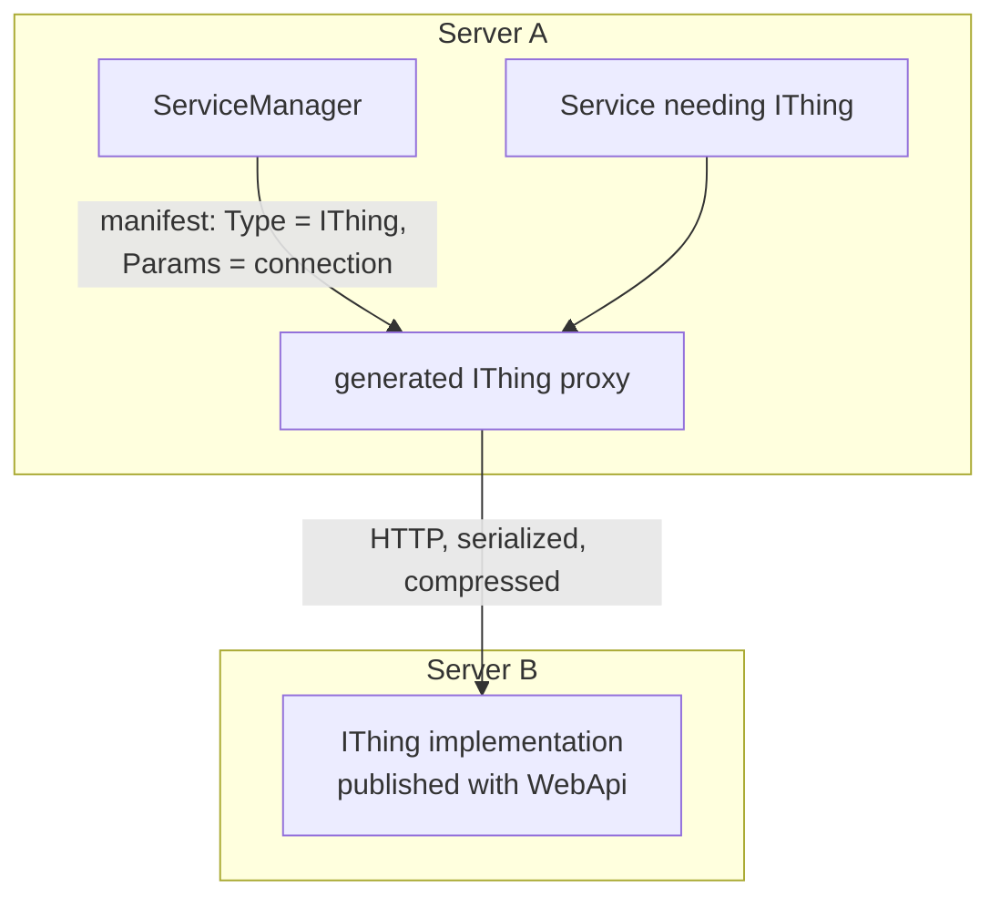

# SysWeaver.Remote.Connection

[⬆ SysWeaver overview](../README.md)

> Runtime engine for remote APIs: generates classes implementing `IRemoteApi` interfaces that perform HTTP calls with SysWeaver serialization, compression, caching, authentication and concurrency limits. Enables local and remote services to be interchangeable.

| | |
|---|---|
| **Layer** | Remote APIs |
| **Kind** | Library |

## Purpose

Make distribution a deployment decision. A service that depends on an interface does not care whether the implementation runs in-process or on another server: the manifest either lists a local implementation, or lists the *interface* with connection parameters, and the service manager creates a remote proxy.

## How it fits into SysWeaver



## Key features

- Implementation emitted at runtime (IL generation) and cached per interface.
- Base URL, bearer token / API key, time-outs, accepted and sent compression, serializer choice, concurrency limit and response caching per connection.
- Error messages can be stripped of URLs to avoid leaking sensitive information.
- Helpers for calling SysWeaver servers directly with `HttpClient`.
- Registered proxies are flagged as remote, so consumers can prefer local or remote instances.

## Limitations and considerations

- Remote calls have network semantics (latency, failures, time-outs) even though they look like method calls; design interfaces accordingly (coarse-grained, async).
- Types crossing the wire must be serializable by the chosen serializer.
- Runtime code generation requires a runtime that supports dynamic code (not AOT-only environments).

## Using it

```json
{ "Type": "SysWeaver.Remote.Services.IIpApiCom, SysWeaver.Remote.Services",
  "Params": { "BaseUrl": "http://ip-api.com/" } }
```
```csharp
var api = new RemoteConnection { BaseUrl = "https://other-server/" }.Create<IMyApi>();
```

## Relationships

- **Project:** [`SysWeaver.Remote.Connection.csproj`](SysWeaver.Remote.Connection.csproj)
- **Builds on:** [SysWeaver.Common](../SysWeaver.Common/README.md), [SysWeaver.Compression](../SysWeaver.Compression/README.md), [SysWeaver.Remote](../SysWeaver.Remote/README.md), [SysWeaver.Serialization](../SysWeaver.Serialization/README.md)
- **Used by:** [SysWeaver.ExchangeRate](../SysWeaver.ExchangeRate/README.md), [SysWeaver.FolderSync](../SysWeaver.FolderSync/README.md), [SysWeaver.MicroServices.ServiceManager](../SysWeaver.MicroServices.ServiceManager/README.md), [SysWeaver.ReverseProxy](../SysWeaver.ReverseProxy/README.md), [SysWeaver.Security](../SysWeaver.Security/README.md)
