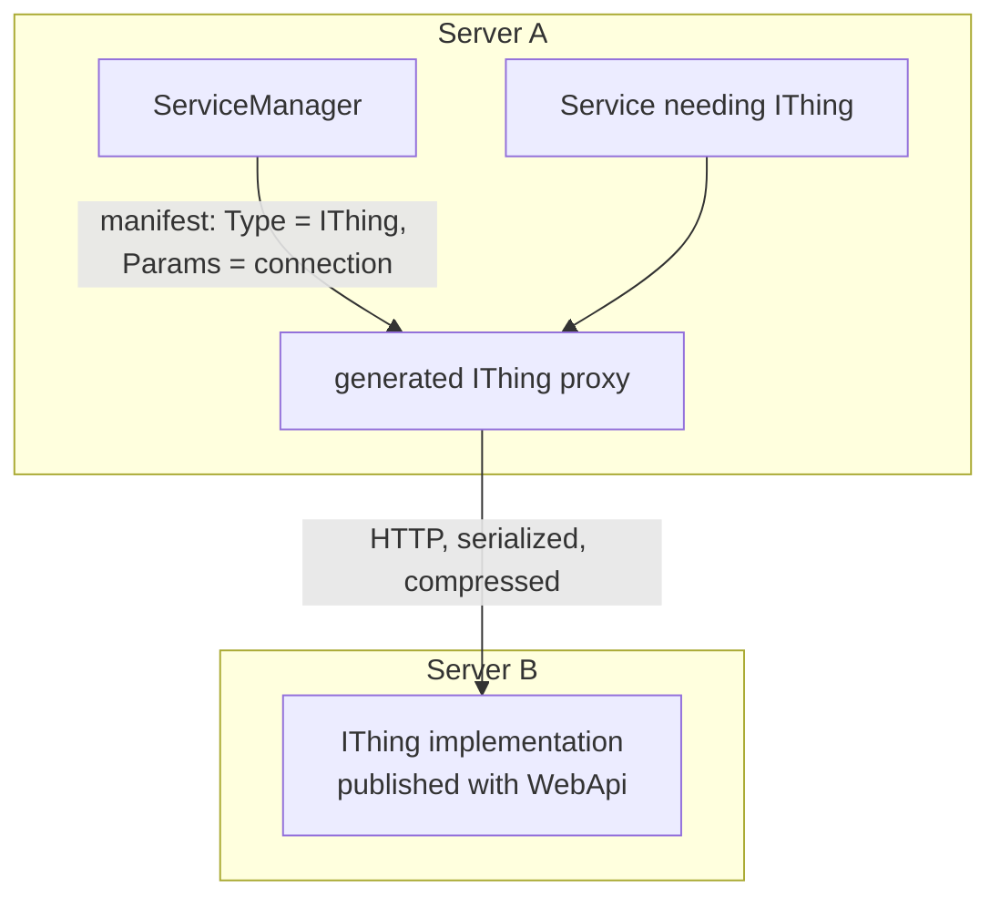

# SysWeaver.Remote.Connection

[⬆ SysWeaver overview](../README.md)

> Runtime engine for remote APIs: generates classes implementing `IRemoteApi` interfaces that perform HTTP calls with SysWeaver serialization, compression, caching, authentication and concurrency limits. Enables local and remote services to be interchangeable.

| | |
|---|---|
| **Layer** | Remote APIs |
| **Kind** | Library |

## Purpose

Make distribution a deployment decision. A service that depends on an interface does not care whether the implementation runs in-process or on another server: the manifest either lists a local implementation, or lists the *interface* with connection parameters, and the service manager creates a remote proxy.

## How it fits into SysWeaver



## Key features

- Implementation emitted at runtime (IL generation) and cached per interface; each method declared on the interface becomes an end point (`RemoteEndPoint` attribute, or by default GET for parameterless methods and POST otherwise, prefixed by `RemotePathPrefix`).
- GET/DELETE parameters are formatted into the url from a template such as `Get?id={Id}`; POST/PUT parameters are sent as the serialized payload (multiple parameters as an `object[]`, or as an object with `ParamAsObject`).
- Per connection: base URL (path templates, or read from a file), auth (bearer token / API key, Basic, a custom header via a `*header` user name, or the SysWeaver challenge login), time-out, accepted and sent compression, serializer choice (json by default, write-only `formUrl` available), max connections per server, proxy or Tor, certificate validation, user agent and response caching.
- Per end point: serializers, time-out and an LRU response cache (GET/DELETE only) via `RemoteSerializer`, `RemoteTimeout` and `RemoteCache` attributes.
- Call monitoring through `IRemoteApi.OnCallBegin` / `OnCallEnd`, per-endpoint timing (`PerfMon`) and per-method failure statistics.
- Error messages can be stripped of URLs to avoid leaking sensitive information.
- Helpers for calling SysWeaver servers directly with `HttpClient` (json / raw POST, login / logout, file upload).
- Proxies created by the service manager from a manifest are registered as remote, so consumers can prefer local or remote instances.

## Key types

| Type | Role |
|---|---|
| `RemoteConnection` | Connection parameters (usually the manifest `Params`) and `Create<T>()` / `Create(Type)` factory |
| `RemoteConnectionBase` | Base class of the generated implementations; owns the `HttpClient`, exposes `UrlBase`, `Client`, stats |
| `RemoteAuthMethod` | `HttpAuth` (Bearer / Basic / custom header) or `SysWeaverLogin` |
| `EndPointOptions` | Per end point serializer / time-out overrides (built from attributes) |
| `FormUrlSerializer` | Write-only `application/x-www-form-urlencoded` serializer (`formUrl`) |
| `JsonRequestExt` | `HttpClient` extensions to POST json or raw payloads |
| `SysWeaverHttpClientExt` | `HttpClient` extensions for SysWeaver login, logout and file upload |
| `RemoteConnectionExt` | The same SysWeaver actions on a generated remote API instance |

## Limitations and considerations

- Remote calls have network semantics (latency, failures, time-outs) even though they look like method calls; design interfaces accordingly (coarse-grained, async).
- Interfaces must be public, inherit `IDisposable` (optionally `IRemoteApi`) and every method must return `Task` or `Task<T>` (`ValueTask` return types are accepted by the generator but not usable).
- Types crossing the wire must be serializable by the chosen serializer; cached responses are shared between callers, so don't mutate them.
- The connection time-out is also the `HttpClient` time-out, so a per end point time-out can only shorten it. `RemoteCache` on an interface (rather than a method) is not applied.
- With `SysWeaverLogin` the login is performed synchronously when the instance is created.
- Runtime code generation requires a runtime that supports dynamic code (not AOT-only environments).

## Using it

```json
{ "Type": "SysWeaver.Remote.Services.IIpApiCom, SysWeaver.Remote.Services",
  "Params": { "BaseUrl": "http://ip-api.com/" } }
```
```csharp
using var api = new RemoteConnection { BaseUrl = "https://other-server/", BearerToken = "key" }.Create<IMyApi>();
```

## Relationships

- **Project:** [`SysWeaver.Remote.Connection.csproj`](SysWeaver.Remote.Connection.csproj)
- **Builds on:** [SysWeaver.Common](../SysWeaver.Common/README.md), [SysWeaver.Compression](../SysWeaver.Compression/README.md), [SysWeaver.Remote](../SysWeaver.Remote/README.md), [SysWeaver.Serialization](../SysWeaver.Serialization/README.md)
- **Used by:** [SysWeaver.ExchangeRate](../SysWeaver.ExchangeRate/README.md), [SysWeaver.FolderSync](../SysWeaver.FolderSync/README.md), [SysWeaver.MicroServices.ServiceManager](../SysWeaver.MicroServices.ServiceManager/README.md), [SysWeaver.ReverseProxy](../SysWeaver.ReverseProxy/README.md), [SysWeaver.Security](../SysWeaver.Security/README.md)
