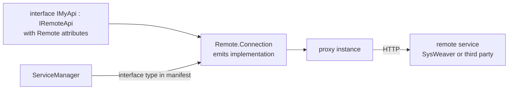

# SysWeaver.Remote

[⬆ SysWeaver overview](../README.md)

> Declarative HTTP client contracts: describe a remote API as a C# interface with attributes, and SysWeaver generates the implementation.

| | |
|---|---|
| **Layer** | Remote APIs (contracts) |
| **Kind** | Attribute library (no dependencies) |

## Purpose

Calling an HTTP API should look like calling a local method. An interface deriving from `IRemoteApi` describes endpoints, verbs, path templates, serializers, time-outs and caching; [SysWeaver.Remote.Connection](../SysWeaver.Remote.Connection/README.md) turns it into a working client. Because this assembly has no dependencies, API contracts can be shared cheaply between servers and clients.

## How it fits into SysWeaver

## Key features

- Endpoint path templates and HTTP verbs per method.
- Per-interface or per-method serializer, time-out and cache overrides.
- Option to send multiple parameters as an object rather than an array.

## Limitations and considerations

- Contracts only; nothing works without [SysWeaver.Remote.Connection](../SysWeaver.Remote.Connection/README.md).

## Relationships

- **Project:** [`SysWeaver.Remote.csproj`](SysWeaver.Remote.csproj)
- **Used by:** [SysWeaver.Remote.Connection](../SysWeaver.Remote.Connection/README.md), [SysWeaver.Remote.Services](../SysWeaver.Remote.Services/README.md)
