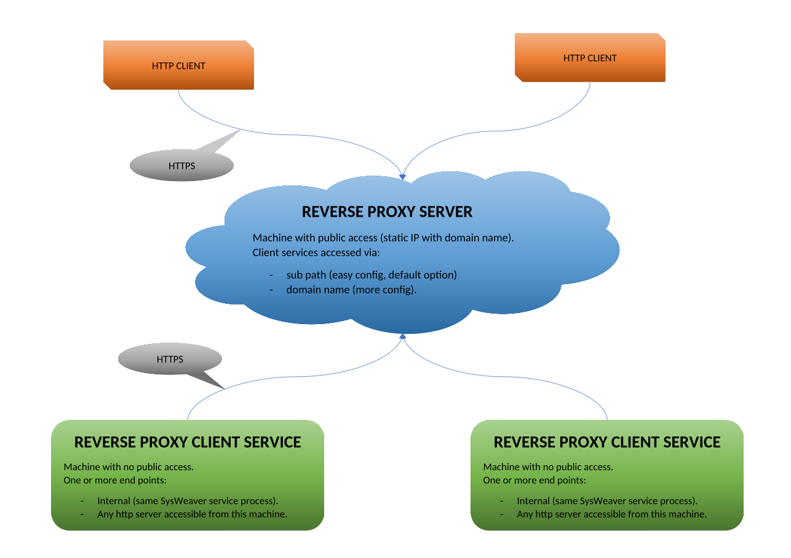

# OVERVIEW

The reverse proxy is a http proxy so that you can access services on machines that isn't visible to the internet (i.e no IP, routing etc).

## SERVER

Server can either route to clients using a sub path (in the url) or using the domain name.

### SUB PATH ROUTING (default)
The syntax is: https://*domain*/*base path*/*client id*-*end point*/*remote path*  
- *domain* is the ip or domain name to the proxy service, ex: *proxy.example.com*.
- *base path* is defined in the server params and defaults to: *ReverseProxyFiles*.   
- *client id* is the id that a client connection is using, only a-z, A-Z and 0-9 are valid chars.   
- *end point* is the name of the end point that the client connection accepts, only a-z, A-Z and 0-9 are valid chars.   
- *remote path* is the local name on the local end point.
If the client only have a single end point it can be configured to ignore an end-point name, the syntax is then *base path*/*client id*/*remote path*

An example: two clients named ComputerA and ComputerB that have two end points each named Service1 and Service2:
- *https://proxy.example.com/ReverseProxyFiles/ComputerA-Service1/index.html* to access *index.html* on service 1 on computer A
- *https://proxy.example.com/ReverseProxyFiles/ComputerA-Service2/index.html* to access *index.html* on service 2 on computer A
- *https://proxy.example.com/ReverseProxyFiles/ComputerB-Service2/index.html* to access *index.html* on service 2 on computer B

CAVETS
Many web sites access resouces using rooted path ex: */logo.png*.
If such a resource is accessed using the proxy *https://proxy.example.com/ReverseProxyFiles/ComputerA-Service1/index.html*,  
the resolved url would be *https://proxy.example.com/logo.png*
Domain routing "solves" this, but requires much more configuration (if you have many clients).

### DOMAIN ROUTING
The syntax is https://*client id*-*end point*.*base-domain*/*remote path*  
- *client id* is the id that a client connection is using, only a-z, A-Z and 0-9 are valid chars.   
- *end point* is the name of the end point that the client connection accepts, only a-z, A-Z and 0-9 are valid chars.   
- *base-domain* is the base domain name to the proxy service, ex: *exmplae.com*.
- *remote path* is the local name on the local end point.

An example: two clients named ComputerA and ComputerB that have two end points each named Service1 and Service2:
- *https://ComputerA-Service1.example.com/index.html* to access *index.html* on service 1 on computer A
- *https://ComputerA-Service2.example.com/index.html* to access *index.html* on service 2 on computer A
- *https://ComputerB-Service2.example.com/index.html* to access *index.html* on service 2 on computer B
 
CAVETS
You need to define A records for all Computer/Service pairs (or use a wildcard dns, but that will limit the whole domain to a single computer).
You need to listen to all prefixes (or use a wildcard listeners, blocking that port for any other services on that machine).
You need a certificate for all prefixes if https is required (or use a wild card certificate).

## CLIENT

Clients must configure:
- A remote proxy server address, ex: *https://proxy.example.com*.
- Service credentials for that server (typically a key file).
- One or more end points (the service defaults to have a single end point to it self).

### END POINTS
- Can be local (the same SysWeaver service that have the reverse proxy client), then all handling is internal (no web client calls).
- Can be local host: *http://localhost:1212/ProxyRoot/*.
- Can be on the LAN: *http://192.168.1.200:999* or *http://internal-services/*.
- Can beanything a http request can reach: *https://www.aljazeera.com/*.

