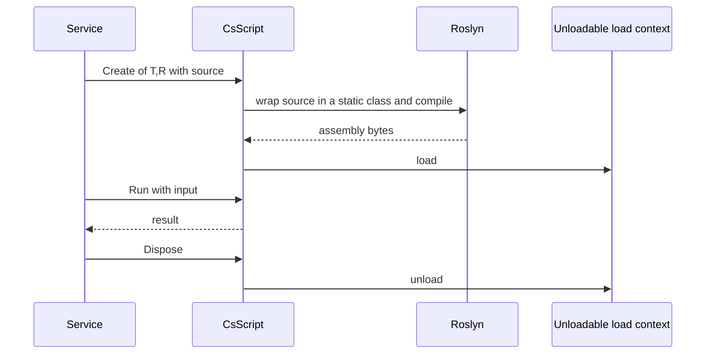

# SysWeaver.Script

[⬆ SysWeaver overview](../README.md)

> Runtime C# scripting: compile a snippet with Roslyn into an unloadable assembly and call it like a function.

| | |
|---|---|
| **Layer** | Foundation |
| **Kind** | Library |

## Purpose

Enables configurable behaviour written in real C# (rules, transformations, custom logic) without recompiling the service, while allowing the compiled code to be unloaded again.

## How it fits into SysWeaver



## Key features

- The script is the *body* of a static class: you write members, including a static `Main` that takes one input and returns a result (sync or async variants).
- Extra assemblies/types can be made available to the script; a sensible default set is always referenced.
- Each script lives in its own collectible load context and is released on dispose.

## Limitations and considerations

- Scripts run with the full permissions of the host process — only run trusted code.
- Compilation is comparatively expensive; create once and reuse.
- The expected `Main` signature is enforced at creation time (a mismatch throws).

## Using it

```csharp
using SysWeaver.Script;
using var s = CsScript.Create<int, int>("static int Main(int x) => x * x;");
int r = s.Run(12);
```

## Relationships

- **Project:** [`SysWeaver.Script.csproj`](SysWeaver.Script.csproj)
