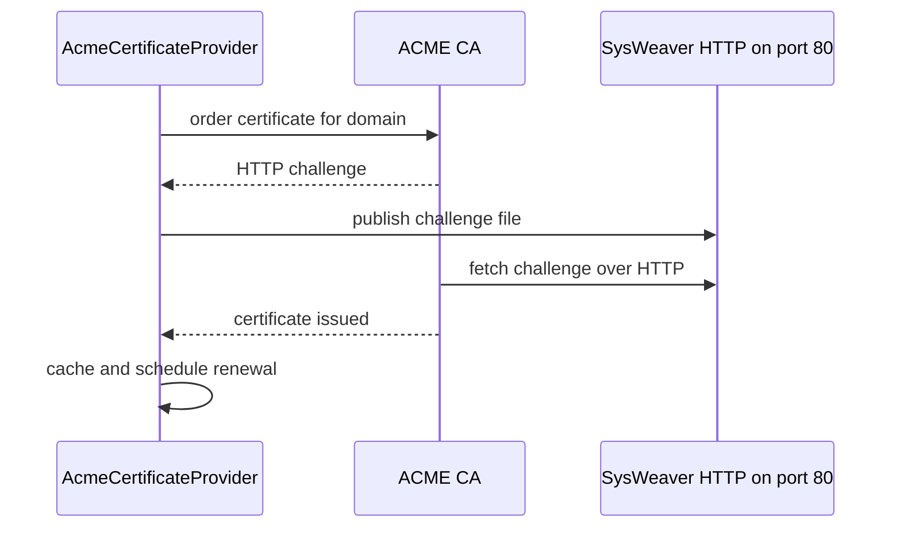

# SysWeaver.Security.Acme

[⬆ SysWeaver overview](../README.md)

> Automatic public certificates via ACME (Let's Encrypt by default), validated through HTTP challenges served by SysWeaver itself.

| | |
|---|---|
| **Layer** | Security |
| **Kind** | Certificate provider |

## Purpose

Obtain and renew browser-trusted certificates for public domains with no manual steps.

## How it fits into SysWeaver



## Limitations and considerations

- The domain must resolve to the server and port 80 must be reachable from the internet.
- Subject to the CA's rate limits; certificates are cached to avoid unnecessary orders.

## Using it

```json
{ "Type": "SysWeaver.Security.AcmeCertificateProvider, SysWeaver.Security.Acme",
  "Params": { "DomainName": "www.example.com" } }
```

## Relationships

- **Project:** [`SysWeaver.Security.Acme.csproj`](SysWeaver.Security.Acme.csproj)
- **Builds on:** [SysWeaver.NetHttpServer](../SysWeaver.NetHttpServer/README.md), [SysWeaver.Security](../SysWeaver.Security/README.md)
- **Used by:** [SysWeaver.MicroService.LanCertificateManager](../SysWeaver.MicroService.LanCertificateManager/README.md)
