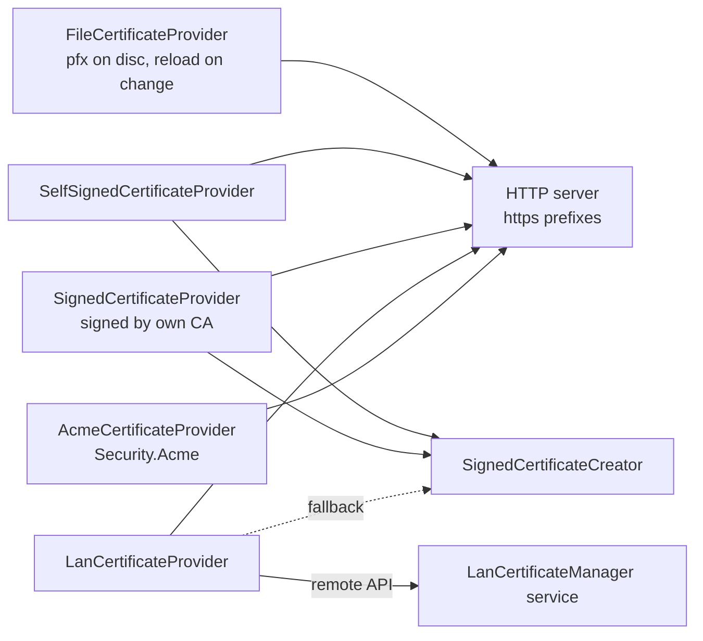

# SysWeaver.Security

[⬆ SysWeaver overview](../README.md)

> Certificate providers for HTTPS: certificates from files, self-signed certificates, certificates signed by your own CA, and LAN certificates issued by a central SysWeaver certificate manager.

| | |
|---|---|
| **Layer** | Security |
| **Kind** | Services (`ICertificateProvider` implementations) |

## Purpose

Decouple where certificates come from and how they are renewed from the web server that uses them. HTTPS prefixes of the HTTP server services select a registered provider by name (or `"*"` for the first one), and the servers pick up renewals through the provider's `OnChanged` event.

## How it fits into SysWeaver



## Key types

| Type | Description |
|---|---|
| `FileCertificateProvider` | Loads a certificate from a `.pfx` (via `ManagedFile`, so the file is monitored); the password can be given directly or as the name of a file containing it. |
| `SelfSignedCertificateProvider` | Generates a self-signed RSA certificate, caches it as `.pfx` (plus a PEM `.crt`) and regenerates it when the parameters change or it is about to expire. |
| `SignedCertificateProvider` | Generates a certificate signed by a local root (CA) `.pfx`; can publish the public root certificate (`.pem`/`.crt`) on the web server (it is also an `IHttpServerModule`) so clients can install it. Monitors the root file. |
| `LanCertificateProvider` | Fetches the certificate for a LAN domain from a central `ILanCertificateManager` service (polls hourly); falls back to a self-signed certificate while the manager is unavailable. |
| `SignedCertificateCreator` | Builds the subject and subject alternative names (localhost, machine name, configured names, LAN IPs) and creates self-signed or CA-signed TLS server certificates. |
| `CertificateBaseParams` / `CertificateParams` / `CertificateProviderParams` | Shared parameters: cache file and password, subject fields, SAN options, key size, validity and renewal timing. |
| `ILanCertificateManager`, `GetLanCertRequest`, `GetLanCertResponse` | The remote API (`Api/Lcm/`) used by `LanCertificateProvider`. |

## Key features

- Several certificate strategies with a common contract (`ICertificateProvider` from SysWeaver.Common).
- Change notifications so servers rebind renewed certificates without restarts.
- Named providers so different prefixes can use different certificates.
- Generated certificates are cached between executions (default under `$(CommonApplicationData)\SysWeaver_AppData_$(AppName)`) and reused while they still match the configuration.

## Limitations and considerations

- Self-signed and privately signed certificates are only trusted by clients that trust the issuer.
- Providers must be registered before the HTTP server service.
- Generated certificates are RSA (SHA256) with a fixed 4 day back-dating; the cached `.pfx` password defaults to the application name, so protect the cache folder with file system permissions.
- Certificates are loaded with machine key storage (`CertificateTools.InMemoryKeyStorageFlags` = `MachineKeySet | Exportable`), which typically requires elevated rights on Windows. The key isn't persisted: the temporary key file in `%ProgramData%\Microsoft\Crypto\...\MachineKeys` is deleted when the certificate is disposed (so renewals and LAN polls no longer accumulate key files). `EphemeralKeySet` isn't used since SslStream (SChannel) can't use ephemeral keys on Windows. `CertificateTools.Install` (used by the HttpListener / http.sys binding) adds a copy with a persisted key to the machine store.
- With `IncludeLanIPs` enabled, a change of the local IP addresses causes a new certificate to be generated.

## Using it

```json
[
  { "Type": "SysWeaver.Security.SelfSignedCertificateProvider, SysWeaver.Security" },
  { "Type": "SysWeaver.MicroService.AspHttpServerService, SysWeaver.MicroService.AspHttpServer",
    "Params": { "ListenOn": [ { "Prefix": "https://*:8443", "Certificate": "*" } ] } }
]
```

## Relationships

- **Project:** [`SysWeaver.Security.csproj`](SysWeaver.Security.csproj)
- **Builds on:** [SysWeaver.Common](../SysWeaver.Common/README.md), [SysWeaver.HttpServer](../SysWeaver.HttpServer/README.md), [SysWeaver.IsoData](../SysWeaver.IsoData/README.md), [SysWeaver.Remote.Connection](../SysWeaver.Remote.Connection/README.md)
- **Used by:** [SysWeaver.Security.Acme](../SysWeaver.Security.Acme/README.md)
