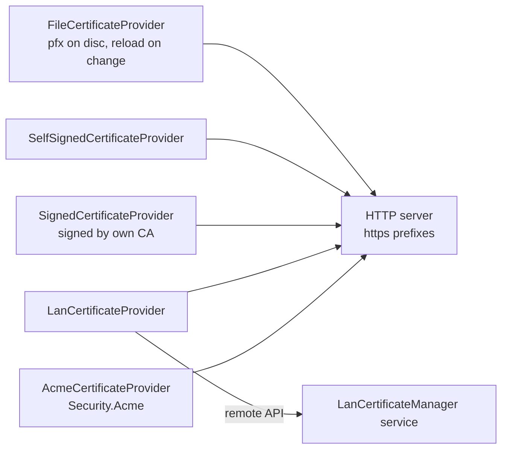

# SysWeaver.Security

[⬆ SysWeaver overview](../README.md)

> Certificate providers for HTTPS: certificates from files, self-signed certificates, certificates signed by your own CA, and LAN certificates issued by a central SysWeaver certificate manager.

| | |
|---|---|
| **Layer** | Security |
| **Kind** | Services (`ICertificateProvider` implementations) |

## Purpose

Decouple where certificates come from and how they are renewed from the web server that uses them. The HTTP server services bind every registered provider (by name) to the HTTPS prefixes that request it, and pick up renewals.

## How it fits into SysWeaver



## Key features

- Several certificate strategies with a common contract.
- Change notifications so servers rebind renewed certificates without restarts.
- Named providers so different prefixes can use different certificates.

## Limitations and considerations

- Self-signed and privately signed certificates are only trusted by clients that trust the issuer.
- Providers must be registered before the HTTP server service.

## Using it

```json
[
  { "Type": "SysWeaver.Security.SelfSignedCertificateProvider, SysWeaver.Security" },
  { "Type": "SysWeaver.MicroService.AspHttpServerService, SysWeaver.MicroService.AspHttpServer",
    "Params": { "ListenOn": [ { "Prefix": "https://*:8443", "Certificate": "*" } ] } }
]
```

## Relationships

- **Project:** [`SysWeaver.Security.csproj`](SysWeaver.Security.csproj)
- **Builds on:** [SysWeaver.Common](../SysWeaver.Common/README.md), [SysWeaver.HttpServer](../SysWeaver.HttpServer/README.md), [SysWeaver.IsoData](../SysWeaver.IsoData/README.md), [SysWeaver.Remote.Connection](../SysWeaver.Remote.Connection/README.md)
- **Used by:** [SysWeaver.Security.Acme](../SysWeaver.Security.Acme/README.md)
