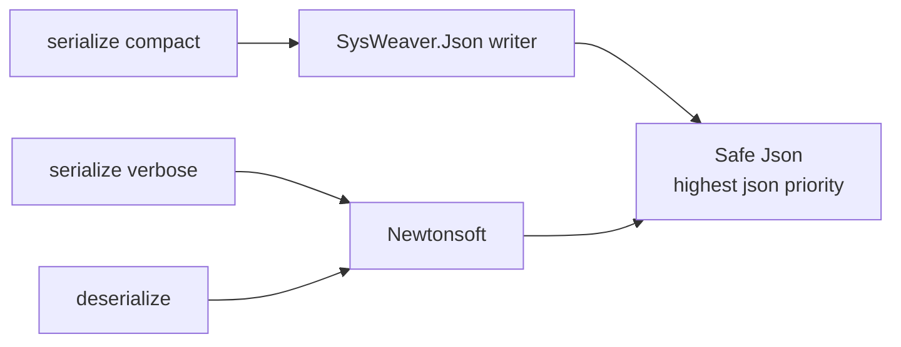

# SysWeaver.Serialization.SafeJson

[⬆ SysWeaver overview](../README.md)

> A composite JSON serializer that writes with SysWeaver's fast JSON writer and reads with the tolerant Newtonsoft parser — and takes precedence over all other JSON serializers when registered.

| | |
|---|---|
| **Layer** | Serialization |
| **Kind** | Serializer plug-in |

## Purpose

Combine the strengths of two implementations: fast, compact output for responses and storage, and forgiving, well-proven parsing for input coming from clients and files.

## How it fits into SysWeaver



## Key features

- Highest priority of all JSON serializers, so registering it makes it *the* JSON implementation of the process.
- Human-readable formatted output available for diagnostics.

## Limitations and considerations

- Reading and writing use different engines; types must serialize compatibly with both.
- Pulls in both the SysWeaver JSON and Newtonsoft JSON plug-ins.

## Using it

```json
{ "Type": "SysWeaver.Serialization.SafeJsonSerializer, SysWeaver.Serialization.SafeJson" }
```

## Relationships

- **Project:** [`SysWeaver.Serialization.SafeJson.csproj`](SysWeaver.Serialization.SafeJson.csproj)
- **Builds on:** [SysWeaver.Serialization.NewtonsoftJson](../Serialization/SysWeaver.Serialization.NewtonsoftJson/README.md), [SysWeaver.Serialization.SwJson](../Serialization/SysWeaver.Serialization.SwJson/README.md), [SysWeaver.Serialization](../SysWeaver.Serialization/README.md)
