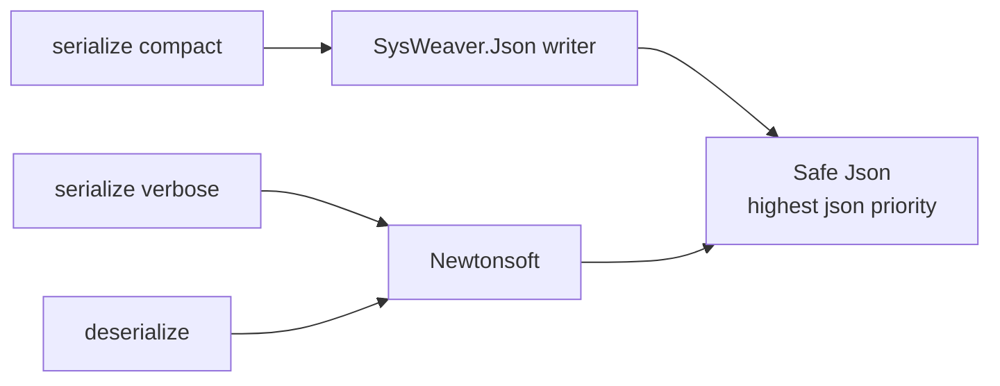

# SysWeaver.Serialization.SafeJson

[⬆ SysWeaver overview](../README.md)

> A composite JSON serializer that writes with SysWeaver's fast JSON writer and reads with the tolerant Newtonsoft parser — and takes precedence over all other JSON serializers when registered.

| | |
|---|---|
| **Layer** | Serialization |
| **Kind** | Serializer plug-in |

## Purpose

Combine the strengths of two implementations: fast, compact output for responses and storage, and forgiving, well-proven parsing for input coming from clients and files.

## How it fits into SysWeaver



## Key features

- `SafeJsonSerializer` (singleton `Instance`) has priority 10, the highest of all bundled JSON serializers, so registering it makes it *the* JSON implementation of the process.
- `Compact` and `Typeless` output is written by SysWeaver.Json; `Verbose` output is written by Newtonsoft (indented, `$type` on every object); all input is read by Newtonsoft.
- `SafeJsonSerializer.ToFormattedJson` gives human-readable output (byte arrays as aligned number rows) for diagnostics.

## Limitations and considerations

- Reading and writing use different engines; types must serialize compatibly with both.
- Pulls in both the SysWeaver JSON and Newtonsoft JSON plug-ins.
- Reading goes through Newtonsoft with `$type` handling enabled; `$type` names are restricted by the `DataTypePolicy` (see [SysWeaver.Serialization.NewtonsoftJson](../Serialization/SysWeaver.Serialization.NewtonsoftJson/README.md)). Avoid `object` members in input models where possible.
- Registering it does not register the Newtonsoft and SysWeaver.Json serializers themselves; they are only used internally.

## Using it

```json
{ "Type": "SysWeaver.Serialization.SafeJsonSerializer, SysWeaver.Serialization.SafeJson" }
```

Or register it from code at startup: `SysWeaver.Serialization.SafeJsonSerializer.Register();`

## Relationships

- **Project:** [`SysWeaver.Serialization.SafeJson.csproj`](SysWeaver.Serialization.SafeJson.csproj)
- **Builds on:** [SysWeaver.Serialization.NewtonsoftJson](../Serialization/SysWeaver.Serialization.NewtonsoftJson/README.md), [SysWeaver.Serialization.SwJson](../Serialization/SysWeaver.Serialization.SwJson/README.md), [SysWeaver.Serialization](../SysWeaver.Serialization/README.md)
