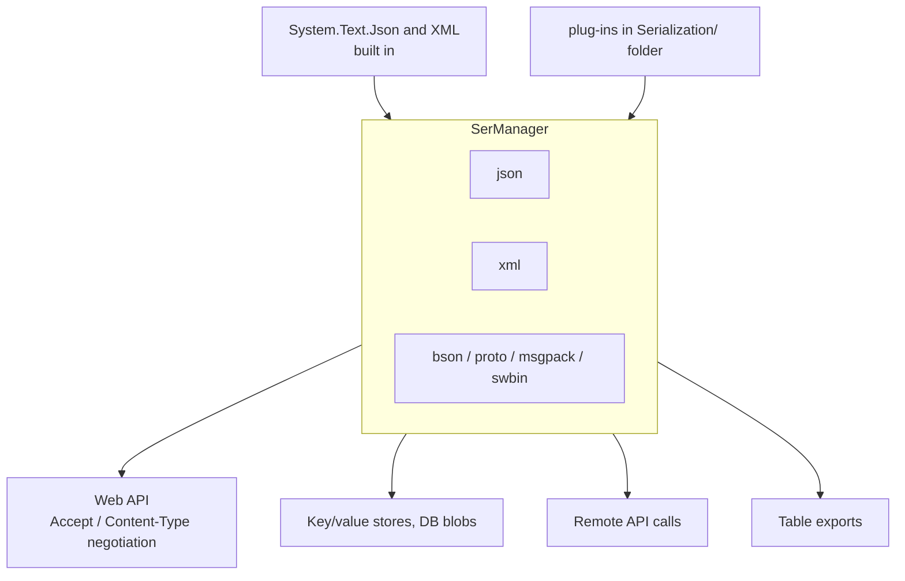

# SysWeaver.Serialization

[⬆ SysWeaver overview](../README.md)

> The serialization abstraction of SysWeaver and its registry: every component serializes through named, prioritised serializer types selected by file extension / MIME type. Includes System.Text.Json and XML implementations.

| | |
|---|---|
| **Layer** | Serialization |
| **Kind** | Library (abstraction + registry + built-ins) |

## Purpose

Decouple *what* is serialized from *how*. Services, the API server, storage and remote connections ask the registry for "json", "xml", "msgpack", … and get the best registered implementation. Formats are added by dropping in plug-ins, without touching the consumers.

## How it fits into SysWeaver



## Key concepts

| Concept | Description |
|---|---|
| **Serializer type** | A named implementation with extension, MIME type, text/binary nature and a *priority*. |
| **Priority** | When several serializers share an extension, the highest priority wins — this is how a plug-in can become the default JSON implementation. |
| **Text vs. binary** | Text serializers additionally support string input/output. |
| **Compact vs. verbose** | Serialization options for compact wire output or human-readable output. |
| **Type name resolution** | Robust lookup of types from names for polymorphic scenarios. |

## Key features

- One registry for the whole process; formats are addressed by the same short names as file extensions.
- System.Text.Json registered by default; XML available on request.
- Plug-ins for Newtonsoft JSON/BSON, Protobuf, MessagePack, SysWeaver's own JSON and binary formats, and several alternative JSON libraries.

## Limitations and considerations

- The registry is process-wide static state: registering a higher-priority serializer changes behaviour for every consumer in the process.
- Behaviour differences between JSON implementations (casing, field handling, polymorphism) mean the choice of default JSON serializer is an application-level decision.

## Using it

```csharp
using SysWeaver.Serialization;
var json = SerManager.GetText("json");
string text = json.ToString(new { Id = 1 });
```

Register plug-ins in the manifest, e.g. `{ "Type": "SysWeaver.Serialization.SysWeaverJsonSerializer, SysWeaver.Serialization.SwJson" }`.

## Relationships

- **Project:** [`SysWeaver.Serialization.csproj`](SysWeaver.Serialization.csproj)
- **Builds on:** [SysWeaver.Common](../SysWeaver.Common/README.md)
- **Used by:** [SysWeaver.DbSimpleStack](../SysWeaver.DbSimpleStack/README.md), [SysWeaver.ExchangeRate](../SysWeaver.ExchangeRate/README.md), [SysWeaver.HttpServer](../SysWeaver.HttpServer/README.md), [SysWeaver.Knowledge](../SysWeaver.Knowledge/README.md), [SysWeaver.Map](../SysWeaver.Map/README.md), [SysWeaver.Remote.Connection](../SysWeaver.Remote.Connection/README.md), [SysWeaver.Serialization.CompactJson](../Serialization/SysWeaver.Serialization.CompactJson/README.md), [SysWeaver.Serialization.JilJson](../Serialization/SysWeaver.Serialization.JilJson/README.md), [SysWeaver.Serialization.MessagePack](../Serialization/SysWeaver.Serialization.MessagePack/README.md), [SysWeaver.Serialization.NewtonsoftBson](../Serialization/SysWeaver.Serialization.NewtonsoftBson/README.md), [SysWeaver.Serialization.NewtonsoftJson](../Serialization/SysWeaver.Serialization.NewtonsoftJson/README.md), [SysWeaver.Serialization.ProtobufNet](../Serialization/SysWeaver.Serialization.ProtobufNet/README.md), [SysWeaver.Serialization.SafeJson](../SysWeaver.Serialization.SafeJson/README.md), [SysWeaver.Serialization.SpanJson](../Serialization/SysWeaver.Serialization.SpanJson/README.md), [SysWeaver.Serialization.SwBinary](../Serialization/SysWeaver.Serialization.SwBinary/README.md), [SysWeaver.Serialization.SwJson](../Serialization/SysWeaver.Serialization.SwJson/README.md), [SysWeaver.Serialization.Utf8Json](../Serialization/SysWeaver.Serialization.Utf8Json/README.md), [SysWeaver.Storage](../SysWeaver.Storage/README.md), [SysWeaver.TableData](../SysWeaver.TableData/README.md)
