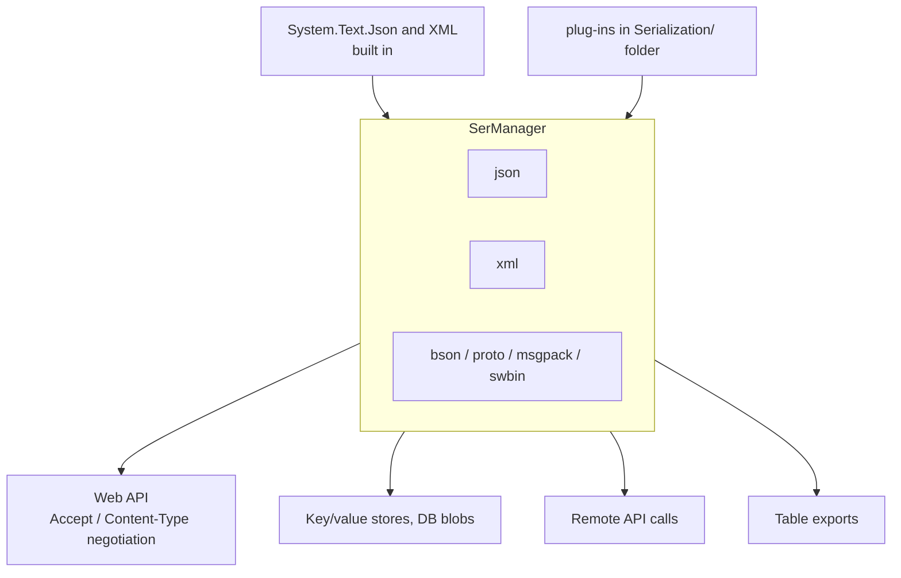

# SysWeaver.Serialization

[⬆ SysWeaver overview](../README.md)

> The serialization abstraction of SysWeaver and its registry: every component serializes through named, prioritised serializer types selected by file extension. Includes System.Text.Json and XML implementations.

| | |
|---|---|
| **Layer** | Serialization |
| **Kind** | Library (abstraction + registry + built-ins) |

## Purpose

Decouple *what* is serialized from *how*. Services, the API server, storage and remote connections ask the registry for "json", "xml", "msgpack", … and get the best registered implementation. Formats are added by dropping in plug-ins, without touching the consumers.

## How it fits into SysWeaver



## Key concepts

| Concept | Description |
|---|---|
| **Serializer type** | `ISerializerType`: a named, stateless singleton with extension, MIME type, Content-Type header, encoding (null for binary) and a *priority*; `Serialize<T>` returns `ReadOnlyMemory<byte>`, `Create<T>` reads from `ReadOnlyMemory<byte>` / `ReadOnlySpan<byte>`. |
| **Priority** | When several serializers share an extension, the highest priority wins (ties: the last registered) — this is how a plug-in can become the default JSON implementation. |
| **Text vs. binary** | `ITextSerializerType` serializers additionally support string input/output (`ToString<T>`, `FromString<T>`); `SerManager.GetText` only considers these. |
| **Compact vs. verbose** | `SerializerOptions.Compact`, `Verbose` and `Typeless` are hints: Newtonsoft-based serializers use them for indentation and `$type` output, System.Text.Json/CompactJson only for indentation, the rest ignore them. |
| **Type name resolution** | `TypeNameResolver.Get` finds types from (assembly qualified) names, falling back to a case-insensitive scan of all loaded assemblies; results, including misses, are cached. |

## Key features

- One registry for the whole process (`SerManager`); formats are addressed by the same short names as file extensions, with or without a leading dot (`"json"`, `".json"`).
- `NetJsonSerializer` (System.Text.Json, priority 0) is always registered; `NetXmlSerializer` (XmlSerializer) is available via `NetXmlSerializer.Register()`.
- `SerExtensions` adds `ToJsonString`, `ToJsonData` and `FromJsonData` extension methods that use the active `json` serializer (default option: `Verbose`).
- `SerTools.SerializeWithoutType` / `TextSerTools.ToStringWithoutType` serialize an `object` as its runtime type; `SerTools.MakeHeader` builds `Content-Type` values with a charset.
- Plug-ins for Newtonsoft JSON/BSON, Protobuf, MessagePack, SysWeaver's own JSON and binary formats, and several alternative JSON libraries.

## Limitations and considerations

- The registry is process-wide static state: registering a higher-priority serializer changes behaviour for every consumer in the process. Register serializers at startup: `SerManager.AddType` is not thread-safe, and many consumers resolve and cache a serializer on first use, so later registrations are not seen by them (`SerExtensions` resolves the serializer on every call).
- `NetJsonSerializer` writes with relaxed escaping (HTML-sensitive and non-ASCII characters are not escaped); escape before embedding output in HTML.
- Extension lookups are case-sensitive; pass lowercase extensions.
- Behaviour differences between JSON implementations (casing, field handling, polymorphism) mean the choice of default JSON serializer is an application-level decision.

## Using it

```csharp
using SysWeaver.Serialization;
var json = SerManager.GetText("json");
string text = json.ToString(new { Id = 1 });
```

Register plug-ins at startup (e.g. `SysWeaverJsonSerializer.Register();`) or in the manifest; the service manager calls the static `Register` method of any `ISerializerType` listed, e.g. `{ "Type": "SysWeaver.Serialization.SysWeaverJsonSerializer, SysWeaver.Serialization.SwJson" }`.

## Relationships

- **Project:** [`SysWeaver.Serialization.csproj`](SysWeaver.Serialization.csproj)
- **Builds on:** [SysWeaver.Common](../SysWeaver.Common/README.md)
- **Used by:** [SysWeaver.DbSimpleStack](../SysWeaver.DbSimpleStack/README.md), [SysWeaver.ExchangeRate](../SysWeaver.ExchangeRate/README.md), [SysWeaver.HttpServer](../SysWeaver.HttpServer/README.md), [SysWeaver.Knowledge](../SysWeaver.Knowledge/README.md), [SysWeaver.Map](../SysWeaver.Map/README.md), [SysWeaver.Remote.Connection](../SysWeaver.Remote.Connection/README.md), [SysWeaver.Serialization.CompactJson](../Serialization/SysWeaver.Serialization.CompactJson/README.md), [SysWeaver.Serialization.MessagePack](../Serialization/SysWeaver.Serialization.MessagePack/README.md), [SysWeaver.Serialization.NewtonsoftBson](../Serialization/SysWeaver.Serialization.NewtonsoftBson/README.md), [SysWeaver.Serialization.NewtonsoftJson](../Serialization/SysWeaver.Serialization.NewtonsoftJson/README.md), [SysWeaver.Serialization.ProtobufNet](../Serialization/SysWeaver.Serialization.ProtobufNet/README.md), [SysWeaver.Serialization.SafeJson](../SysWeaver.Serialization.SafeJson/README.md), [SysWeaver.Serialization.SpanJson](../Serialization/SysWeaver.Serialization.SpanJson/README.md), [SysWeaver.Serialization.SwBinary](../Serialization/SysWeaver.Serialization.SwBinary/README.md), [SysWeaver.Serialization.SwJson](../Serialization/SysWeaver.Serialization.SwJson/README.md), [SysWeaver.Serialization.Utf8Json](../Serialization/SysWeaver.Serialization.Utf8Json/README.md), [SysWeaver.Storage](../SysWeaver.Storage/README.md), [SysWeaver.TableData](../SysWeaver.TableData/README.md)
