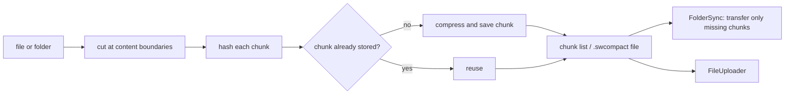

# SysWeaver.Storage.Cdc

[⬆ SysWeaver overview](../README.md)

> Content-defined chunking (CDC) storage: files are split at content-dependent boundaries into hashed, compressed, de-duplicated chunks, and whole files or folders are represented as compact chunk lists.

| | |
|---|---|
| **Layer** | Storage |
| **Kind** | Library |

## Purpose

Efficient versioned storage and transfer of large, slowly changing data (deployments, backups, media folders). Because chunk boundaries depend on content rather than fixed offsets, an edit only changes the chunks around it; unchanged chunks are stored and transferred once.

## How it fits into SysWeaver



## Key features

- Compact and expand files or whole folders to/from a single chunk-list file.
- Verification, recovery of damaged archives (missing chunks are marked) and pruning of unused chunks.
- APIs to compute missing chunks for a list and to stream a chunk list as one continuous stream — the basis of delta synchronisation.
- Pluggable hash and compression; chunk storage spread over several folders.

## Limitations and considerations

- Pruning permanently deletes chunks; archives that still reference them become unrecoverable.
- Chunk stores grow with history until pruned.
- Throughput and de-duplication ratio depend on chunk size settings.

## Using it

```csharp
await ContentDependentChunking.Compact(@"D:\Data\Project", @"D:\Backup\Project.swcompact");
await ContentDependentChunking.Expand(@"D:\Backup\Project.swcompact", @"D:\Restore\Project");
```
Used by [SysWeaver.FolderSync](../SysWeaver.FolderSync/README.md), [SysWeaver.MicroService.FolderSync](../SysWeaver.MicroService.FolderSync/README.md) and [SysWeaver.MicroService.FileUploader](../SysWeaver.MicroService.FileUploader/README.md).

## Relationships

- **Project:** [`SysWeaver.Storage.Cdc.csproj`](SysWeaver.Storage.Cdc.csproj)
- **Builds on:** [SysWeaver.Storage](../SysWeaver.Storage/README.md)
- **Used by:** [SysWeaver.FolderSync](../SysWeaver.FolderSync/README.md), [SysWeaver.MicroService.FileUploader](../SysWeaver.MicroService.FileUploader/README.md), [SysWeaver.MicroService.FolderSync](../SysWeaver.MicroService.FolderSync/README.md)
