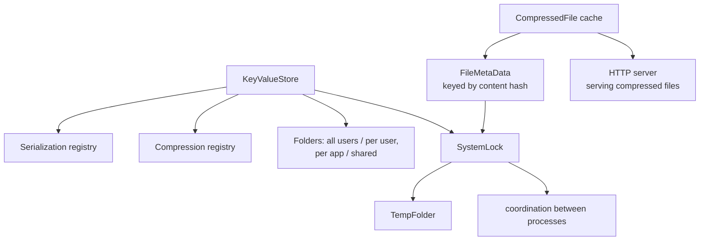

# SysWeaver.Storage

[⬆ SysWeaver overview](../README.md)

> Local persistence primitives: a redundant file-based key/value store, cached compressed copies of files, file meta-data databases, temporary cache folders and machine-wide locks.

| | |
|---|---|
| **Layer** | Storage |
| **Kind** | Library |

## Purpose

Most services need a little durable state (settings, caches, small records) without running a database. This project provides it on top of the file system, using the framework's serializers and compressors, and with redundancy and checksums so a single corrupted file does not lose data.

## How it fits into SysWeaver



## Key concepts

| Concept | Description |
|---|---|
| **Key/value store** (`KeyValueStore`) | Values are serialized, compressed (Brotli by default), suffixed with a SHA256 checksum and written as several redundant copies (at least 2, default 3), optionally spread over multiple volumes. Reads return the most recent valid copy; corrupt copies are deleted. Each key is protected by a `SystemLock`. Four static stores exist (`AllApp`, `UserApp`, `AllShared`, `UserShared`); custom stores are created with `KeyValueStore.Get(KeyValueStoreParams)` and cached by id. |
| **Compressed file cache** (`CompressedFile`) | Opens / reads a compressed version of a file and caches it on disc keyed by the file's content hash, compression type and level, so frequently served files are compressed once. |
| **File meta data** (`FileMetaData`, `FileMetaDataDb<T>`, `FileMetaDataDbAsync<T>`) | Associates derived data (json, gzip compressed) and derived files with a file's content hash and rebuilds it when the content changes; unused entries are pruned at process exit. |
| **Decompressed file hash** (`DecompressedFileHash`) | Cached MD5-based hash of the *decompressed* content of a compressed file. |
| **Compressed chunked stream** (`CompressedChunkedStream`) | A read-only stream that concatenates the decompressed content of several compressed chunks. |
| **Embedded resources** (`StorageTypeExt`) | `Type.GetManifestResourceStream/Data/Text/Object` helpers that transparently decompress resources stored compressed (ex: `MyText.txt.br`). |
| **System lock** (`SystemLock`) | A named lock visible to all processes on the machine, implemented with exclusively opened lock files (delete on close) so it works on every OS. Not re-entrant. |
| **Temp folder** (`TempFolder`) | Named cache folders (configurable, default under CommonApplicationData) whose old files are pruned at process exit. |

## Key features

- Zero-setup persistence with async and sync APIs.
- Redundant writes, checksums and multi-folder distribution for robustness.
- Pluggable serializer and compressor per store.
- Cross-process locking.

## Limitations and considerations

- Designed for small-to-medium values and moderate write rates; it is not a database (no queries, transactions or indexing). Every operation reads or writes all copies of a key.
- Redundancy multiplies disk usage by the number of copies.
- Keys are used as file names; only valid file name characters may be used (this is only verified in DEBUG builds).
- Currently all four static stores share the id `"Default"`, so `UserApp`, `AllShared` and `UserShared` return the same instance as `AllApp` (application specific, all users).
- File-based locks depend on a shared temporary location and cooperative use; waiting is done by polling.
- Cleanup of caches and temp folders only happens at process exit.

## Using it

```csharp
await KeyValueStore.AllApp.SetAsync("last-sync", DateTime.UtcNow);
var last = await KeyValueStore.AllApp.TryGetAsync<DateTime>("last-sync");

using (SystemLock.Get("MyApp.Migration")) { /* one process at a time */ }

using var s = await CompressedFile.OpenAsync(path, CompManager.GetFromHttp("br"));
```

## Relationships

- **Project:** [`SysWeaver.Storage.csproj`](SysWeaver.Storage.csproj)
- **Builds on:** [SysWeaver.Common.Linux](../SysWeaver.Common.Linux/README.md), [SysWeaver.Common.Windows](../SysWeaver.Common.Windows/README.md), [SysWeaver.Common](../SysWeaver.Common/README.md), [SysWeaver.Compression](../SysWeaver.Compression/README.md), [SysWeaver.Serialization](../SysWeaver.Serialization/README.md)
- **Used by:** [SysWeaver.AI.LlmTranslator](../SysWeaver.AI.LlmTranslator/README.md), [SysWeaver.Auth.Core](../SysWeaver.Auth.Core/README.md), [SysWeaver.FolderSync](../SysWeaver.FolderSync/README.md), [SysWeaver.Media](../SysWeaver.Media/README.md), [SysWeaver.MicroService.HttpServer](../SysWeaver.MicroService.HttpServer/README.md), [SysWeaver.Storage.Cdc](../SysWeaver.Storage.Cdc/README.md)
