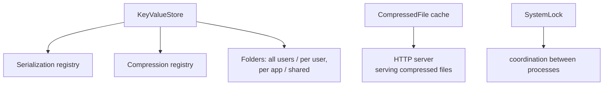

# SysWeaver.Storage

[⬆ SysWeaver overview](../README.md)

> Local persistence primitives: a redundant file-based key/value store, cached compressed copies of files, file meta-data databases and machine-wide locks.

| | |
|---|---|
| **Layer** | Storage |
| **Kind** | Library |

## Purpose

Most services need a little durable state (settings, caches, small records) without running a database. This project provides it on top of the file system, using the framework's serializers and compressors, and with redundancy so a single corrupted file does not lose data.

## How it fits into SysWeaver



## Key concepts

| Concept | Description |
|---|---|
| **Key/value store** | Values are serialized, compressed and written as several redundant copies, optionally spread over multiple volumes. Four ready-made stores exist: per application or shared, for all users or per user. Custom stores are created from parameters. |
| **Compressed file cache** | Opens a compressed version of a file and caches it, so frequently served files are compressed once. |
| **File meta data** | Associates derived data (e.g. hashes) with files and rebuilds it when the file changes. |
| **System lock** | A lock visible to all processes on the machine, implemented with lock files so it works on every OS. |

## Key features

- Zero-setup persistence with async and sync APIs.
- Redundant writes and multi-folder distribution for robustness.
- Pluggable serializer and compressor per store.
- Cross-process locking.

## Limitations and considerations

- Designed for small-to-medium values and moderate write rates; it is not a database (no queries, transactions or indexing).
- Redundancy multiplies disk usage by the number of copies.
- File-based locks depend on a shared temporary location and cooperative use.

## Using it

```csharp
await KeyValueStore.AllApp.SetAsync("last-sync", DateTime.UtcNow);
var last = await KeyValueStore.AllApp.TryGetAsync<DateTime>("last-sync");

using (SystemLock.Get("MyApp.Migration")) { /* one process at a time */ }
```

## Relationships

- **Project:** [`SysWeaver.Storage.csproj`](SysWeaver.Storage.csproj)
- **Builds on:** [SysWeaver.Common.Linux](../SysWeaver.Common.Linux/README.md), [SysWeaver.Common.Windows](../SysWeaver.Common.Windows/README.md), [SysWeaver.Common](../SysWeaver.Common/README.md), [SysWeaver.Compression](../SysWeaver.Compression/README.md), [SysWeaver.Serialization](../SysWeaver.Serialization/README.md)
- **Used by:** [SysWeaver.AI.LlmTranslator](../SysWeaver.AI.LlmTranslator/README.md), [SysWeaver.Auth.Core](../SysWeaver.Auth.Core/README.md), [SysWeaver.FolderSync](../SysWeaver.FolderSync/README.md), [SysWeaver.Media](../SysWeaver.Media/README.md), [SysWeaver.MicroService.HttpServer](../SysWeaver.MicroService.HttpServer/README.md), [SysWeaver.Storage.Cdc](../SysWeaver.Storage.Cdc/README.md)
