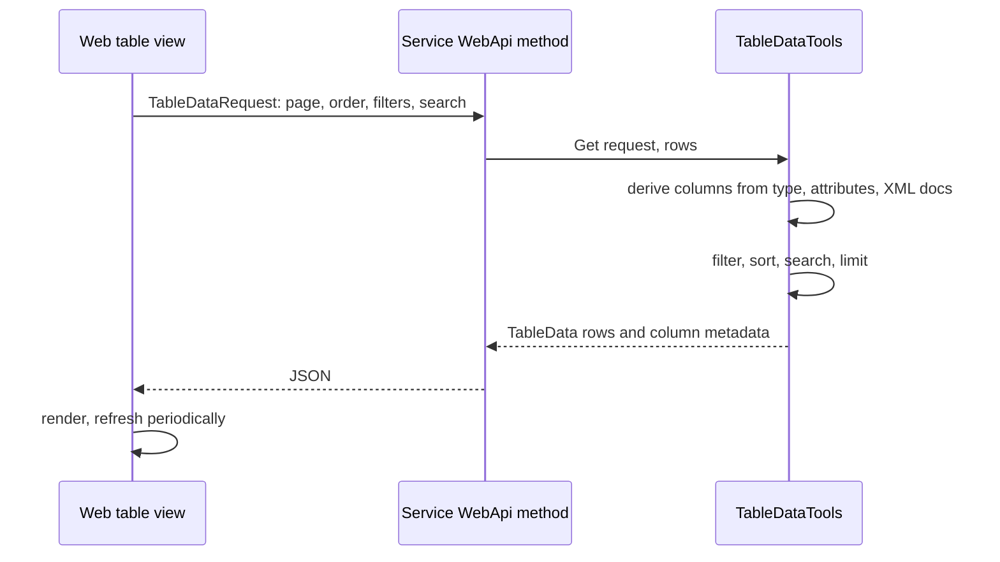

# SysWeaver.TableData

[⬆ SysWeaver overview](../README.md)

> The table engine behind every data grid in the SysWeaver web UI: turns any sequence of objects into paged, sorted, filtered, searchable, translatable and exportable table data, driven by attributes on the row type.

| | |
|---|---|
| **Layer** | Data |
| **Kind** | Library |

## Purpose

A service should expose tabular information by returning a collection — not by building a UI. `TableDataTools` inspects the row type, applies the client's request (page, order, filters, search) and returns rows plus column metadata that the web UI renders generically, including formatting hints such as byte sizes, durations, links, images or flags.

The shared contracts (`TableData`, `TypedTableData<T>`, `TableDataRequest`, `TableDataColumn`, `TableDataFilter`, `ITableDataExporter` and the `TableData*` attributes) live in [SysWeaver.Common](../SysWeaver.Common/README.md) (namespace `SysWeaver.Data`); this project contains the engine that implements them.

## How it fits into SysWeaver



Menu entries created with `[WebMenuTable]` point the UI's generic table page at such an API. The service manager uses this for its own diagnostic tables.

## Key features

- Column definitions derived automatically from the row type's public fields and properties, `TableData*` attributes (name, title, order, hide, key, sort, search weight, format, expand) and XML documentation. Per-type metadata and compiled (expression tree) code for extraction, sorting and filtering is built once and cached.
- Per-column filters (`TableDataFilterOps`: equals/compare, contains/starts/ends with, any/none of a comma separated list, in/outside a range; optionally case sensitive or inverted), multi-column ordering, ranked free-text search, paging with look-ahead and row limits.
- A column change counter (`Cc`, unique per server process) so column definitions and title are only sent when the client doesn't already have them; refresh rate hints.
- Translation of `[AutoTranslate]` columns through an `ITranslator` (`TableDataTools.Translate`, `TypeTranslator`); struct members, struct array elements and struct table rows are written back after translation, use `TypeTranslator.TranslateValue` / `TranslateBoxed` for a struct root value (a struct passed by value to `TypeTranslator.Translate` is translated in a copy).
- Typed tables (`GetTyped`, rows are the objects themselves) as well as boxed rows (`Get`).
- Static tables from in-memory data or from untyped `object[]` rows with explicit column definitions (`GetStaticTableFn`, using dynamically emitted row types).
- Exporters: `CsvTableDataExporter` (comma, tab, semicolon), `HtmlTableDataExporter.Simple` and `MarkDownTableDataExporter`; JSON and Excel exporters live in other projects.
- Data references (`DataReferenceStorage`, `TableDataReference`, `DataScopes`): server-side stored tables with scope (global, signed-in users, session) and a sliding expiry, which can be viewed, exported or edited through a reference id.
- Table editing (`TableDataEdit`, `TableDataOp`, `EditTableDataRequest`): select/remove columns, append tables, merge columns from two tables, add computed columns from expressions (`NewTableDataColumn`), filter/sort/limit; exposed to the web UI and AI tools by the HTTP server.

## Limitations and considerations

- Processing happens in memory over the supplied sequence; for very large datasets filter at the source first.
- `TableDataTools.Get` / `GetTyped` (and `TableDataType<T>.Get` / `GetTyped`) cap the requested row count server side: a request with no limit (`MaxRowCount` zero or negative) or above the cap gets at most `maxAllowedRows` rows (optional parameter, default `TableDataTools.DefaultMaxAllowedRows` = 100000; rows + look ahead never exceed it; zero or negative disables the cap for trusted server side callers). `ExtractGet` applies no cap, callers must cap client values themselves. Processing exceptions are swallowed (returning an empty table).
- Only supported primitive types (numbers, `bool`, `string`, date/time types, `Guid`, `Type`, `Exception`, `object`), enums and their nullables become columns; other members are skipped unless marked with `[TableDataExpand]`.
- The per-user data scope (`DataScopes.User`) is declared but not supported yet. Data reference ids are random (unguessable), but anyone who knows a global or any-user scoped id can access that data.
- Column aggregation (`TableDataEdit.Aggregate`) is not implemented yet (throws `NotImplementedException`).

## Using it

```csharp
public sealed class OrderRow { public long Id; public string Customer; public TimeSpan Age; }

[WebApi]
[WebApiAuth(Roles.Ops)]
[WebMenuTable(null, "Orders/{0}", "Orders", null, "IconTableServices")]
public TableData OrdersTable(TableDataRequest r) => TableDataTools.Get(r, 5000, Rows); // 5000 = refresh rate in ms
```

## Relationships

- **Project:** [`SysWeaver.TableData.csproj`](SysWeaver.TableData.csproj)
- **Builds on:** [SysWeaver.Common](../SysWeaver.Common/README.md), [SysWeaver.Compression](../SysWeaver.Compression/README.md), [SysWeaver.Docs](../SysWeaver.Docs/README.md), [SysWeaver.ExpressionEvaluator](../SysWeaver.ExpressionEvaluator/README.md), [SysWeaver.Serialization](../SysWeaver.Serialization/README.md)
- **Used by:** [SysWeaver.Auth.Core](../SysWeaver.Auth.Core/README.md), [SysWeaver.DbSimpleStack](../SysWeaver.DbSimpleStack/README.md), [SysWeaver.HttpServer](../SysWeaver.HttpServer/README.md), [SysWeaver.MicroServices.ServiceManager](../SysWeaver.MicroServices.ServiceManager/README.md), [SysWeaver.TextMessage.Fake](../SysWeaver.TextMessage.Fake/README.md)
