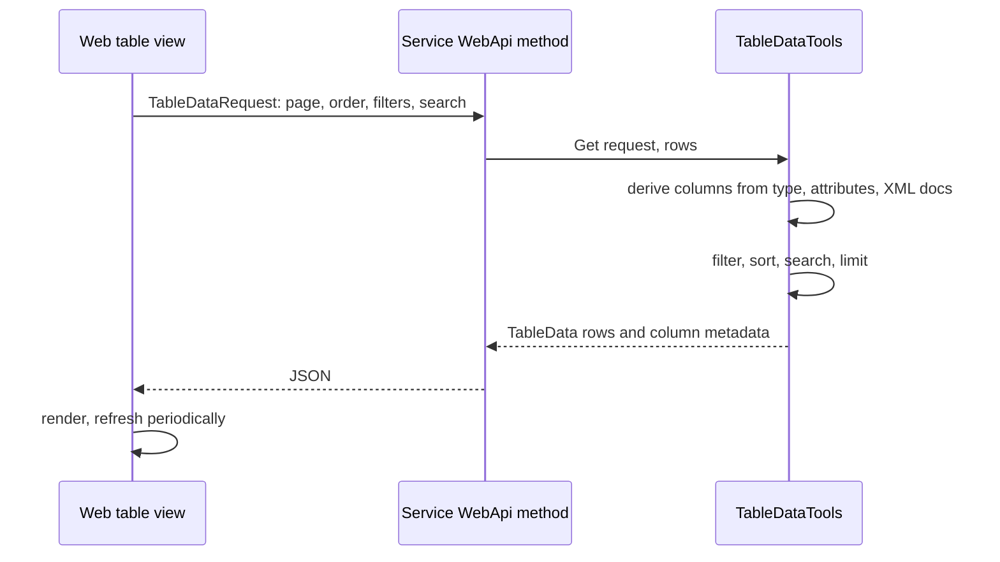

# SysWeaver.TableData

[⬆ SysWeaver overview](../README.md)

> The table engine behind every data grid in the SysWeaver web UI: turns any sequence of objects into paged, sorted, filtered, searchable, translatable and exportable table data, driven by attributes on the row type.

| | |
|---|---|
| **Layer** | Data |
| **Kind** | Library |

## Purpose

A service should expose tabular information by returning a collection — not by building a UI. `TableData` inspects the row type, applies the client's request (page, order, filters, search) and returns rows plus column metadata that the web UI renders generically, including formatting hints such as byte sizes, durations, links, images or flags.

## How it fits into SysWeaver



Menu entries created with `[WebMenuTable]` point the UI's generic table page at such an API. The service manager uses this for its own diagnostic tables.

## Key features

- Column definitions derived automatically from the row type, formatting attributes and XML documentation.
- Filtering (including expression-based filters), ordering, free-text search and row limits.
- Change counters so clients can skip unchanged data; refresh rate hints.
- Translation of table content through the translation services.
- Exporters (CSV, HTML, Markdown; JSON and Excel via other projects).
- Data references: server-side stored datasets with scope (global, signed-in users, session) and expiry, which can be viewed or edited as tables through a reference id.
- Column operations, merges, aggregations and new computed columns.

## Limitations and considerations

- Processing happens in memory over the supplied sequence; for very large datasets filter at the source first.
- The per-user data scope is declared but documented as not yet supported.

## Using it

```csharp
public sealed class OrderRow { public long Id; public string Customer; public TimeSpan Age; }

[WebApi]
[WebApiAuth(Roles.Ops)]
[WebMenuTable(null, "Orders/{0}", "Orders", null, "IconTableServices")]
public TableData OrdersTable(TableDataRequest r) => TableDataTools.Get(r, 5000, Rows);
```

## Relationships

- **Project:** [`SysWeaver.TableData.csproj`](SysWeaver.TableData.csproj)
- **Builds on:** [SysWeaver.Common](../SysWeaver.Common/README.md), [SysWeaver.Compression](../SysWeaver.Compression/README.md), [SysWeaver.Docs](../SysWeaver.Docs/README.md), [SysWeaver.ExpressionEvaluator](../SysWeaver.ExpressionEvaluator/README.md), [SysWeaver.Serialization](../SysWeaver.Serialization/README.md)
- **Used by:** [SysWeaver.Auth.Core](../SysWeaver.Auth.Core/README.md), [SysWeaver.DbSimpleStack](../SysWeaver.DbSimpleStack/README.md), [SysWeaver.HttpServer](../SysWeaver.HttpServer/README.md), [SysWeaver.MicroServices.ServiceManager](../SysWeaver.MicroServices.ServiceManager/README.md), [SysWeaver.TextMessage.Fake](../SysWeaver.TextMessage.Fake/README.md)
