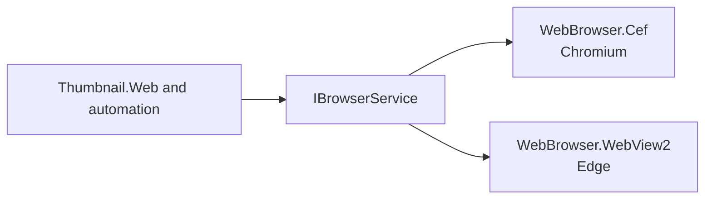

# SysWeaver.WebBrowser

[⬆ SysWeaver overview](../README.md)

> Contracts for headless browser services, so browser automation features do not depend on a particular engine.

| | |
|---|---|
| **Layer** | Automation (contracts) |
| **Kind** | Interface library |

## How it fits into SysWeaver

The engine is chosen by which implementation is listed in the manifest.

## Relationships

- **Project:** [`SysWeaver.WebBrowser.csproj`](SysWeaver.WebBrowser.csproj)
- **Used by:** [SysWeaver.MicroService.Thumbnail.Web](../SysWeaver.MicroService.Thumbnail.Web/README.md), [SysWeaver.WebBrowser.Cef](../SysWeaver.WebBrowser.Cef/README.md), [SysWeaver.WebBrowser.WebView2](../SysWeaver.WebBrowser.WebView2/README.md)
